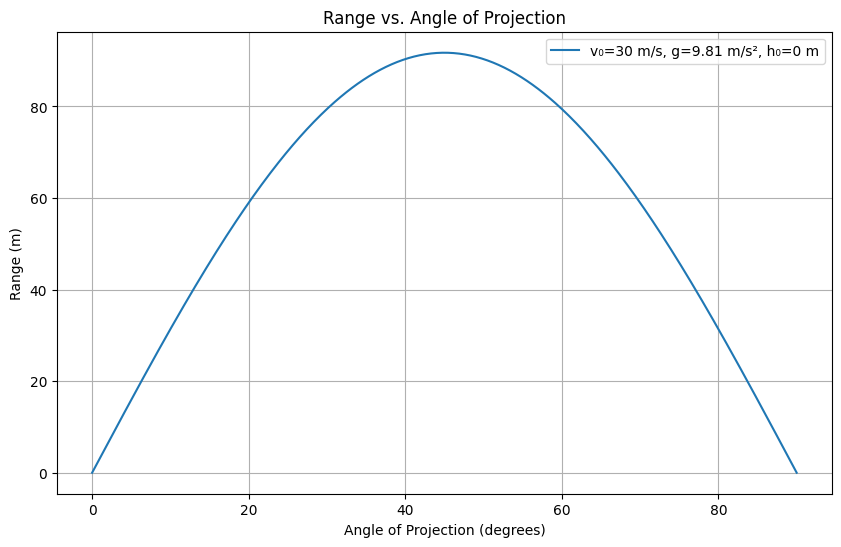
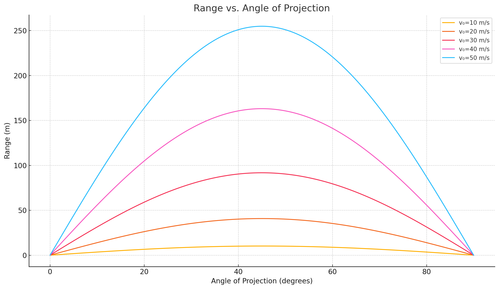

Problem 1
 
 #  Theoretical Foundation

##  Derivation of Projectile Motion from Newton's Laws

We begin by considering a projectile launched with an initial velocity $v_0$ at an angle $\theta$ above the horizontal.

- The motion can be decomposed into two perpendicular components:
  - Horizontal (x-axis)
  - Vertical (y-axis)

###  Assumptions:
- No air resistance  
- Constant gravitational acceleration $g$  
- Launched from the origin at time $t = 0$

---

###  1. **Equations of Motion**

- Horizontal motion (constant velocity):

- Acceleration: $a_x=0$

- Velocity: $v_x=v_0\cos(\theta)$

- Displacement:
$$x(t)=v_0\cos(\theta)\cdot t$$

Vertical motion (accelerated motion):

- Acceleration: $a_y=-g$

- Velocity: $v_y=v_0\sin(\theta)-gt$

- Displacement:
$$y(t)=v_0\sin(\theta)\cdot t-\frac{1}{2}gt^2$$

---

###  2. **Time of Flight**

The projectile hits the ground when $y(t) = 0$. Solving:

$$
v_0\sin(\theta) \cdot t - \frac{1}{2}gt^2 = 0
$$

$$
t(v_0\sin(\theta) - \frac{1}{2}gt) = 0
$$

Non-zero solution:

$$
t = \frac{2v_0\sin(\theta)}{g}
$$

---

### ↔ 3. **Horizontal Range $R$**

Substitute the total time of flight into the horizontal displacement:

$$
R = x(t) = v_0\cos(\theta) \cdot \frac{2v_0\sin(\theta)}{g}
$$

$$
\boxed{R = \frac{v_0^2\sin(2\theta)}{g}}
$$

- This shows that range is **maximum when** $\sin(2\theta) = 1$, i.e. $\theta = 45^\circ$

---

##  4. **Effect of Initial Conditions on Range**

- **Initial Velocity $v_0$**:
  - Range is proportional to $v_0^2$
  - Doubling speed increases range **fourfold**
- **Angle $\theta$**:
  - Affects both vertical and horizontal components
  - Maximum range at $\theta = 45^\circ$ (in symmetric conditions)
- **Gravitational Acceleration $g$**:
  - Inverse relation: higher gravity → shorter range
- **Launch Height (not included above)**:
  - Adds vertical displacement
  - Increases total time in air → longer range (needs new derivation)

---

 These equations form the **idealized model** of projectile motion, laying the foundation for further numerical or simulation-based analysis.
---

#  Analysis of the Range

##  1. Mathematical Relationship Between Range and Angle

Using the derived formula from earlier:

$$
R=\frac{v_0^2\sin(2\theta)}{g}
$$

Where:
- $R$ is the horizontal range
- $v_0$ is the initial velocity
- $\theta$ is the launch angle
- $g$ is the acceleration due to gravity

###  Key Observations:
- Range depends non-linearly on $θ$ through $sin(2θ)$.

- The function $sin(2θ)$ reaches its maximum value of 1 when $2θ=90°$.

- Therefore, the maximum range occurs at:
$$\boxed{θ=45°}$$


---

##  2. Effect of Initial Velocity ($v_0$)

From the formula:

$$
R\propto v_0^2
$$

- Doubling $v_0$ quadruples the range.
- Plotting range vs. angle for different velocities shifts the **amplitude** of the curve but not the position of the peak.

---

##  3. Effect of Gravitational Acceleration ($g$)

- Range is **inversely proportional** to $g$:

$$
R\propto\frac{1}{g}
$$

- Lower gravity (e.g., on the Moon) results in a **longer range**.
- Higher gravity (e.g., on Jupiter) produces a **shorter range**.

---

##  4. Launch Height (Advanced)

When the projectile is launched from a height $h>0$, total time of flight increases.

The vertical displacement becomes:

$$
y(t)=v_0\sin(\theta)t-\frac{1}{2}gt^2+h
$$

To find time of flight $t_f$, solve:

$$
0=h+v_0\sin(\theta)t_f-\frac{1}{2}gt_f^2
$$

This is a quadratic in $t_f$:

$$
\frac{1}{2}gt_f^2-v_0\sin(\theta)t_f-h=0
$$

Solve for $t_f$ using the quadratic formula:

$$
t_f=\frac{v_0\sin(\theta)+\sqrt{(v_0\sin(\theta))^2+2gh}}{g}
$$

Then calculate range:

$$
R=v_0\cos(\theta)\cdot t_f
$$

###  Note:
- Range increases with height.
- The angle for maximum range **no longer remains 45°** when launching from a height.

---

##  Summary

| Parameter            | Effect on Range                       |
|----------------------|----------------------------------------|
| Initial Velocity $v_0$ | Quadratic increase ($\propto v_0^2$)  |
| Launch Angle $\theta$ | Max at $45^\circ$ (flat launch)       |
| Gravity $g$           | Inversely proportional                |
| Launch Height $h$     | Increases range, changes optimal angle |

This analysis provides a full picture of how the **range** responds to varying parameters in ideal and slightly more realistic conditions.
---

#  Practical Applications of Projectile Motion

##  1. Real-World Situations Involving Projectile Motion

Projectile motion is observed in various natural and engineered systems:

- **Sports:**
  - A soccer ball, basketball, or javelin follows a projectile path after being launched.
  - The initial velocity and launch angle determine whether the ball reaches the goal or basket.

- **Engineering:**
  - Water fountains or fire hoses arc based on launch parameters.
  - Ballistics in defense and aerospace engineering heavily depend on accurate projectile modeling.

- **Astrophysics:**
  - Space missions use orbital mechanics — an extension of projectile motion under gravity.
  - Launching a probe involves solving similar equations in non-Earth gravity fields.

---

##  2. Effects of Terrain, Drag, and Wind

###  a. Uneven Terrain

When projectiles land on **non-flat surfaces**, the simple range formula no longer applies.

- Suppose the landing height is different from the launch height $h_0$, then total time of flight $t_f$ must be found by solving:

$$
y(t)=v_0\sin(\theta)t-\frac{1}{2}gt^2+h_0
$$

- Final range becomes:

$$
R=v_0\cos(\theta)\cdot t_f
$$

- Requires solving a **quadratic equation** for $t_f$ and using it in range computation.

###  b. Air Resistance (Drag)

Real trajectories are affected by **drag force** proportional to velocity:

$$
F_d=-kv
$$

Where:
- $F_d$ is the drag force,
- $k$ is a constant depending on air density and shape,
- $v$ is velocity.

This leads to **nonlinear differential equations**:

- In horizontal direction:  
  $$m\frac{dv_x}{dt}=-kv_x$$

- In vertical direction:  
  $$m\frac{dv_y}{dt}=-mg-kv_y$$

These must be solved **numerically** using techniques like Euler’s method or Runge-Kutta.

###  c. Wind

Wind introduces additional velocity components:
- Tailwind increases range.
- Headwind decreases range.
- Crosswind changes the direction of the projectile, affecting accuracy.

Effective horizontal velocity becomes:

$$
v_{\text{effective}}=v_0\cos(\theta)\pm v_{\text{wind}}
$$

---

##  3. Adapting the Model

To make the model more realistic:

- **Include drag**:
  - Use numerical simulation (e.g., Runge-Kutta) to solve motion with air resistance.
- **Include wind**:
  - Modify initial velocity vector to account for wind speed and direction.
- **Simulate terrain**:
  - Adjust impact height based on known terrain elevation data.

---

##  Summary

| Realistic Factor | Effect on Range               | Modeling Approach                     |
|------------------|-------------------------------|----------------------------------------|
| Uneven Terrain   | Alters time of flight         | Quadratic equation with height offset |
| Air Resistance   | Shortens range significantly  | Numerical solution of ODEs            |
| Wind             | Alters path and accuracy      | Adjust velocity components             |

By expanding our model, we bridge the gap between ideal physics and real-world scenarios, increasing the accuracy and relevance of projectile analysis.


#  Implementation: Computational Simulation of Projectile Motion

This section provides a Python implementation to simulate projectile motion, analyze the range as a function of angle, and visualize the effects of varying initial conditions.

---

##  Objective

- Simulate projectile motion under ideal conditions.
- Plot **Range vs. Angle of Projection**.
- Allow the user to vary:
  - Initial velocity $v_0$
  - Gravitational acceleration $g$
  - Initial height $h_0$

---

##  Python Code (Jupyter Notebook Compatible)


---
```python
import numpy as np
import matplotlib.pyplot as plt

# --- Function to calculate range ---
def calculate_range(v0, angle_deg, g=9.81, h0=0):
    angle_rad = np.radians(angle_deg)
    v0x = v0 * np.cos(angle_rad)
    v0y = v0 * np.sin(angle_rad)

    if h0 == 0:
        # Flat terrain (simplified range formula)
        R = (v0**2 * np.sin(2 * angle_rad)) / g
    else:
        # Non-zero launch height, solve for time of flight and range
        t_flight = (v0y + np.sqrt(v0y**2 + 2 * g * h0)) / g
        R = v0x * t_flight
    return R

# --- Function to simulate and plot ---
def plot_range_vs_angle(v0, g=9.81, h0=0):
    angles = np.linspace(0, 90, 500)
    ranges = [calculate_range(v0, angle, g, h0) for angle in angles]

    plt.figure(figsize=(10, 6))
    plt.plot(angles, ranges, label=f'v₀={v0} m/s, g={g} m/s², h₀={h0} m')
    plt.xlabel('Angle of Projection (degrees)')
    plt.ylabel('Range (m)')
    plt.title('Range vs. Angle of Projection')
    plt.grid(True)
    plt.legend()
    plt.show()

# --- Example usage ---
# Modify these parameters to explore different conditions
initial_velocity = 30      # m/s
gravity = 9.81             # m/s²
initial_height = 0         # m

plot_range_vs_angle(initial_velocity, gravity, initial_height)
```

---
```python
import numpy as np
import matplotlib.pyplot as plt

# --- Function to calculate range ---
def calculate_range(v0, angle_deg, g=9.81, h0=0):
    angle_rad = np.radians(angle_deg)
    v0x = v0 * np.cos(angle_rad)
    v0y = v0 * np.sin(angle_rad)

    if h0 == 0:
        # Flat terrain (simplified range formula)
        R = (v0**2 * np.sin(2 * angle_rad)) / g
    else:
        # Non-zero launch height, solve for time of flight and range
        t_flight = (v0y + np.sqrt(v0y**2 + 2 * g * h0)) / g
        R = v0x * t_flight
    return R

# --- Function to simulate and plot ---
def plot_range_vs_angle(v0_values, g=9.81, h0=0):
    angles = np.linspace(0, 90, 500)
    plt.figure(figsize=(12, 7))

    for v0 in v0_values:
        ranges = [calculate_range(v0, angle, g, h0) for angle in angles]
        plt.plot(angles, ranges, label=f'v₀ = {v0} m/s')

    plt.xlabel('Angle of Projection (degrees)')
    plt.ylabel('Range (meters)')
    plt.title('Range vs. Angle of Projection')
    plt.grid(True)
    plt.legend()
    plt.tight_layout()
    plt.show()

# --- Example usage ---
initial_velocities = [10, 20, 30, 40, 50]  # m/s
gravity = 9.81                              # m/s² (Earth)
initial_height = 0                          # m (ground level launch)

plot_range_vs_angle(initial_velocities, gravity, initial_height)
```