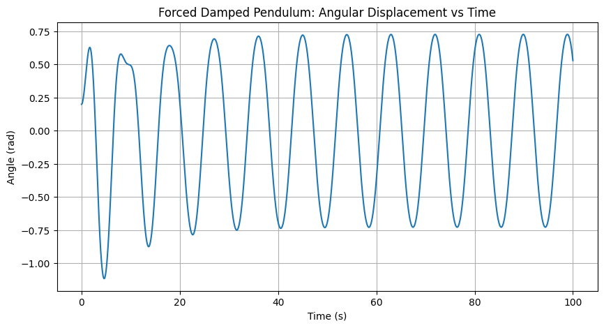

# 📘 Forced Damped Pendulum Analysis

## 1. 🎯 Theoretical Foundation

### Governing Equation

The general form of the differential equation for a **forced damped pendulum** is:

$$\frac{d^2\theta}{dt^2}+\gamma\frac{d\theta}{dt}+\omega_0^2\sin(\theta)=A\cos(\omega t)$$

Where:
- $\theta(t)$: Angular displacement  
- $\gamma$: Damping coefficient  
- $\omega_0$: Natural frequency  
- $A$: Driving amplitude  
- $\omega$: Driving frequency  

### Small-Angle Approximation

For small $\theta$, we use the approximation:

$$\sin(\theta)\approx\theta$$

The equation becomes linear:

$$\frac{d^2\theta}{dt^2}+\gamma\frac{d\theta}{dt}+\omega_0^2\theta=A\cos(\omega t)$$

### Resonance Condition

Resonance occurs when the driving frequency $\omega$ approaches the natural frequency $\omega_0$, leading to maximum amplitude in steady-state oscillations.

---

## 2. 📊 Analysis of Dynamics

Study the effects of:
- Damping ($\gamma$)
- Driving amplitude ($A$)
- Driving frequency ($\omega$)

### Regular vs Chaotic Motion

- Regular: predictable, periodic response
- Chaotic: sensitive to initial conditions, non-repeating patterns

---

## 3. 🌍 Practical Applications

Real-world systems modeled by the forced damped pendulum:
- ⚙️ Energy harvesting devices
- 🌉 Suspension bridges under wind loads
- 🔌 RLC electrical circuits with alternating current

---

## 4. 💻 Implementation in Python



```python
import numpy as np
import matplotlib.pyplot as plt
from scipy.integrate import solve_ivp

# Parameters
gamma = 0.2
omega0 = 1.5
A = 1.2
omega = 0.7

def forced_damped_pendulum(t, y):
    theta, dtheta = y
    d2theta = -gamma * dtheta - omega0**2 * np.sin(theta) + A * np.cos(omega * t)
    return [dtheta, d2theta]

# Initial conditions
y0 = [0.2, 0.0]
t_span = (0, 100)
t_eval = np.linspace(*t_span, 2000)

sol = solve_ivp(forced_damped_pendulum, t_span, y0, t_eval=t_eval)

# Plotting
plt.figure(figsize=(10, 5))
plt.plot(sol.t, sol.y[0])
plt.title("Forced Damped Pendulum: Angular Displacement vs Time")
plt.xlabel("Time (s)")
plt.ylabel("Angle (rad)")
plt.grid(True)
plt.show()


