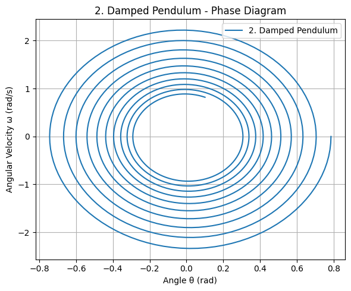

# Investigating the Dynamics of a Forced Damped Pendulum

## 1. Theoretical Foundation

The forced damped pendulum is governed by a second-order nonlinear ordinary differential equation (ODE) that models the angular displacement of a pendulum subjected to both damping and an external periodic force.

---

### 📌 Governing Differential Equation

The general equation of motion for a forced damped pendulum is:

$$
\frac{d^2\theta}{dt^2} + b\frac{d\theta}{dt} + \frac{g}{L} \sin\theta = A\cos(\omega t)
$$

Where:

- **$\theta(t)$**: Angular displacement as a function of time  
- **$b$**: Damping coefficient  
- **$g$**: Acceleration due to gravity  
- **$L$**: Length of the pendulum  
- **$A$**: Amplitude of the external driving force  
- **$\omega$**: Angular frequency of the driving force  
he driving force  

---

### 🔍 Small-Angle Approximation

Under the **small-angle approximation** (where $\theta \ll 1$), we can linearize the sine function as follows:

$$\sin\theta \approx \theta$$

This simplification reduces the governing equation to a **linear inhomogeneous ordinary differential equation (ODE)**:

$$\frac{d^2\theta}{dt^2} + b\frac{d\theta}{dt} + \frac{g}{L}\theta = A\cos(\omega t)$$

---

### 📐 Analytical Solution for Small Angles

The general solution to the linearized ODE consists of two parts:

1. **Homogeneous solution** (related to natural damping):  
$$\theta_h(t)=C_1e^{r_1t}+C_2e^{r_2t}$$  
where $r_1,r_2$ are roots of the characteristic equation:  
$$r^2+br+\frac{g}{L}=0$$

2. **Particular solution** (related to the external forcing):  
We assume a steady-state solution of the form:  

$$\theta_p(t)=B\cos(\omega t-\delta)$$  

where:  
The amplitude of the forced oscillation is denoted by $B$, and the phase lag due to damping is denoted by $\delta$.

The amplitude of the steady-state response is given by:  

$$B=\frac{A}{\sqrt{\left(\frac{g}{L}-\omega^2\right)^2+(b\omega)^2}}$$


---

### 🎯 Resonance Condition

**Resonance** occurs when the driving frequency $\omega$ approaches the natural frequency of the system:

$$
\omega_0=\sqrt{\frac{g}{L}}
$$

At resonance, the system absorbs energy most efficiently from the external force, and the amplitude $B$ reaches a maximum:

- Without damping ($b=0$):
  
$$
B\to\infty\quad\text{as}\quad\omega\to\omega_0
$$

- With damping:

$$
B_{\text{max}}=\frac{A}{b\omega_0}
$$

This finite maximum occurs at a slightly shifted resonance frequency:

$$
\omega_{\text{res}}=\sqrt{\omega_0^2-\frac{b^2}{2}}
$$


---

### ⚡ Energy Behavior at Resonance

The total mechanical energy of the pendulum is the sum of kinetic and potential energy:

$$
E(t) = \frac{1}{2} m L^2 \left(\frac{d\theta}{dt}\right)^2 + mgL(1 - \cos\theta)
$$

- Under resonance:
  - The system continually absorbs energy from the external force.
  - The kinetic energy grows in the undamped case.
  - In the damped case, energy input is balanced by dissipation:
    - Leads to a **steady-state** oscillation.
    - The energy oscillates but remains bounded.

---

### ✅ Summary

- The equation of motion combines restoring, damping, and external driving forces.  
- Linearization using $\sin\theta \approx \theta$ simplifies the analysis for small oscillations.  
- Resonance amplifies oscillation amplitudes and affects energy flow.  
- Damping ensures bounded energy growth even at resonance.  

---

# Investigating the Dynamics of a Forced Damped Pendulum

## 2. Analysis of Dynamics

In this section, we will investigate how the dynamics of the forced damped pendulum are influenced by key parameters such as the **damping coefficient** $b$, **driving amplitude** $A$, and **driving frequency** $\omega$. Additionally, we will explore the transition between **regular motion** and **chaotic behavior**, and interpret the physical meaning of these transitions.

---

### 📊 Effect of Damping Coefficient $b$

The damping coefficient $b$ plays a crucial role in determining the behavior of the system:

- **For low damping** ($b \to 0$), the pendulum oscillates with large amplitudes, and the system is primarily influenced by the restoring force and external periodic force.
- **For high damping** ($b \to \infty$), the pendulum quickly returns to rest, and the oscillations decay exponentially.

Mathematically, the solution to the damped harmonic oscillator can be written as:

$$\theta(t) = \theta_0 e^{-\gamma t} \cos(\omega_0 t + \delta)$$

Where:

- $\gamma = \frac{b}{2m}$ is the damping coefficient.

The **damped frequency** of oscillation is:

$$\omega_d = \sqrt{\omega_0^2 - \gamma^2}$$

The amplitude of the oscillations decays as $e^{-\gamma t}$, and for high damping, this decay leads to the cessation of motion.

---

### 📏 Effect of Driving Amplitude $A$

The driving amplitude $A$ determines how much external force is applied to the system:

- **For small $A$**, the system behaves similarly to an undriven damped pendulum, with oscillations decaying over time.
- **For large $A$**, the system enters a regime where the amplitude of oscillations can grow, especially if resonance occurs.

The steady-state amplitude of the pendulum's oscillations due to external forcing is given by:

$$B = \frac{A}{\sqrt{\left(\frac{g}{L} - \omega^2\right)^2 + (b\omega)^2}}$$

As $A$ increases, the system becomes more sensitive to changes in driving frequency $\omega$, particularly near resonance.

---

### ⚙️ Effect of Driving Frequency $\omega$

The driving frequency $\omega$ determines how quickly the external force oscillates:

- **For $\omega$ close to $\omega_0$ (resonance)**, the system absorbs energy most efficiently, leading to large oscillations.
- **For $\omega$ far from $\omega_0$**, the system experiences weaker driving forces and smaller oscillations.

The resonance condition is given by:

$$\omega_{\text{res}} = \sqrt{\omega_0^2 - \frac{b^2}{2}}$$

---

### 🔄 Transition Between Regular and Chaotic Motion

As we vary the damping coefficient $b$, driving amplitude $A$, and driving frequency $\omega$, the system can exhibit different types of motion:

- **Regular Motion**: For certain values of $A$ and $\omega$, the pendulum exhibits periodic, stable oscillations. This occurs especially at resonance, where the system synchronizes with the external force.  

  - **Stable periodic motion** can be described by a sinusoidal function:  
    $$\theta(t)=B\cos(\omega t-\delta)$$

- **Chaotic Motion**: As $A$ increases or $\omega$ deviates from resonance, the system can enter a **chaotic regime**, where the motion becomes irregular and sensitive to initial conditions.

  - **Chaotic systems** exhibit sensitive dependence on initial conditions, meaning that even tiny differences in initial angles or velocities can lead to vastly different behaviors over time.

  - **Lyapunov exponents** measure the rate of divergence of nearby trajectories in phase space. Positive Lyapunov exponents are often used to identify chaos.


---

### 📐 Phase Diagrams and Poincaré Sections

To identify transitions between regular and chaotic motion, we use:

- **Phase Diagrams**: A plot of $\theta$ vs. $\frac{d\theta}{dt}$, which allows us to visualize the state of the system at any point in time.
- **Poincaré Sections**: A method used to visualize the periodic or chaotic nature of the system by sampling the state of the system at periodic intervals.

The transition to chaos can be observed in a **bifurcation diagram**, which plots the long-term behavior of the system as a function of $A$ or $\omega$.

---

### ⚡ Physical Interpretation of Transitions

- **Regular motion** is characterized by stable periodic oscillations, where the system's energy input and dissipation are balanced. This type of motion is often seen near resonance.  

- **Chaotic motion** occurs when the system's sensitivity to initial conditions becomes dominant, and small changes in $A$, $\omega$, or initial conditions lead to unpredictable motion. This is often observed as the system’s energy becomes irregularly distributed.

The **damping coefficient** $b$ determines the rate at which energy is dissipated. As $b$ increases, the system is less likely to exhibit chaos, and more likely to settle into regular motion.

---

### ✅ Summary

- **Damping coefficient $b$** influences the rate at which the system loses energy, with higher values leading to faster dissipation and lower oscillation amplitudes.
- **Driving amplitude $A$** controls the magnitude of the external force, affecting how large the oscillations can grow, especially near resonance.
- **Driving frequency $\omega$** determines how well the system resonates with the external force, with chaos emerging as the system becomes more sensitive to variations in $\omega$.
- Transitions between regular and chaotic motion depend on the interplay of these parameters. As we approach or move away from resonance, we observe different types of periodic or chaotic behavior.
---

# Investigating the Dynamics of a Forced Damped Pendulum

## 3. Practical Applications

The dynamics of the forced damped pendulum, as studied in previous sections, can be applied to a variety of real-world systems. These systems often exhibit similar behavior, such as oscillations, damping, and the effect of external driving forces. In this section, we will explore several practical applications of the forced damped pendulum model in different fields, including **energy harvesting**, **suspension bridges**, and **oscillating electronic circuits**.

---

### 🌍 Real-World Systems with Similar Dynamics

Several real-world systems exhibit dynamics that closely resemble the behavior of a forced damped pendulum. These systems experience forces that cause oscillations, and the interaction of damping forces and external periodic forces results in complex behavior.

Some examples include:

- **Mechanical Systems**: Mechanical oscillators, such as mass-spring systems, often demonstrate forced oscillations with damping, similar to the pendulum system.
- **Biological Systems**: Systems like human gait or the motion of the heart can be modeled using forced damped oscillators to understand rhythmic movements.
- **Electrical Systems**: Driven RLC circuits, where an external alternating current (AC) force drives the circuit, exhibit similar dynamics to the forced damped pendulum.

---

### 🔋 Energy Harvesting

Energy harvesting is the process of capturing and storing energy from environmental sources, such as vibrations, thermal gradients, or electromagnetic radiation. A common example of energy harvesting involves the use of **vibrational energy harvesters**, which convert mechanical vibrations into electrical energy.

The forced damped pendulum model is particularly useful in designing these energy harvesters because:

- The **driving force** in an energy harvester comes from ambient vibrations, which are external periodic forces that drive oscillations in the system.
- The **damping** represents the energy dissipation due to friction or resistance in the harvester’s mechanical components.
- The **resonance condition** plays a key role in maximizing the energy extraction. When the frequency of ambient vibrations matches the natural frequency of the harvester, the system oscillates with maximum amplitude, allowing for the most efficient conversion of mechanical energy into electrical energy.

The power extracted from the system can be modeled as:

$$
P = \frac{1}{2} m L^2 \left(\frac{d\theta}{dt}\right)^2
$$

Where:

- $P$ is the power extracted from the system.
- $m$ is the mass of the pendulum.
- $L$ is the length of the pendulum.
- $\theta(t)$ is the angular displacement as a function of time.

---

### 🌉 Suspension Bridges

Suspension bridges are large, flexible structures that are susceptible to oscillations due to external forces, such as wind or traffic loads. The dynamics of the forced damped pendulum model can be applied to understand the oscillations of suspension bridges, particularly when considering:

- **External driving forces**, such as wind gusts or traffic-induced vibrations, that act as periodic forces on the bridge.
- **Damping** from the bridge’s material properties, as well as from the air resistance and other frictional forces that act on the structure.
- **Resonance** between the natural frequency of the bridge and the driving frequency (e.g., wind), which can lead to large oscillations if not properly managed.

In suspension bridges, **resonance** can be dangerous, as it can lead to large-amplitude oscillations, potentially causing structural failure. The Tacoma Narrows Bridge collapse in 1940 is a famous example of resonance-induced failure.

The bridge’s motion can be modeled by:

$$
\frac{d^2\theta}{dt^2} + b\frac{d\theta}{dt} + \frac{g}{L} \sin\theta = F_{\text{ext}}(t)
$$

Where:

- $\theta(t)$ is the angular displacement of the bridge.
- $F_{\text{ext}}(t)$ is the external periodic driving force (e.g., wind).
- $b$ is the damping coefficient related to the air resistance and friction.

By controlling the **damping coefficient** and avoiding resonance, engineers can reduce the risk of catastrophic failure in suspension bridges.

---

### 💡 Oscillating Electronic Circuits

In electronics, **RLC circuits** (Resistor, Inductor, Capacitor) are commonly used to model oscillations in driven systems. A forced damped pendulum can be applied to analyze these circuits, as they exhibit similar dynamics:

- **Driving Force**: In an RLC circuit, the external driving force is the alternating current (AC) voltage that drives the system.
- **Damping**: Damping in RLC circuits is represented by the resistance $R$, which dissipates energy.
- **Resonance**: Just like in the pendulum, the circuit exhibits resonance when the driving frequency matches the natural frequency of the LC circuit.

The behavior of an RLC circuit under external driving forces can be described by the following equation:

$$
L \frac{d^2 q}{dt^2} + R \frac{dq}{dt} + \frac{1}{C} q = V_{\text{ext}}(t)
$$

Where:

- $q(t)$ is the charge on the capacitor.
- $V_{\text{ext}}(t)$ is the external driving voltage.
- $L$ is the inductance of the coil.
- $C$ is the capacitance of the capacitor.
- $R$ is the resistance of the circuit.

At resonance, the current in the circuit can become very large, leading to potential damage if not properly controlled. The forced damped pendulum model can be used to predict and mitigate these effects by adjusting the driving frequency and damping characteristics.

---

### ✅ Summary

- **Energy Harvesting**: The forced damped pendulum model helps design efficient vibrational energy harvesters by maximizing energy extraction at resonance.
- **Suspension Bridges**: Understanding resonance and damping in suspension bridges can prevent large amplitude oscillations and avoid structural failure due to external driving forces like wind.
- **Oscillating Electronic Circuits**: The model can also be applied to RLC circuits, where external AC voltages drive oscillations, and resonance must be carefully controlled to avoid damage.

In all these systems, the principles of forced oscillations, damping, and resonance play critical roles in ensuring proper functionality and avoiding failure.


---
```python
import numpy as np
import matplotlib.pyplot as plt
from scipy.integrate import solve_ivp

# Common parameters
g = 9.81      # gravitational acceleration (m/s²)
L = 1.0       # pendulum length (m)
theta0 = 0.2  # small initial angle (radians)
omega0 = 0.0  # initial angular velocity (rad/s)
y0 = [theta0, omega0]
t_span = (0, 20)
t_eval = np.linspace(t_span[0], t_span[1], 1000)

# 1) Simple Pendulum (b = 0, A = 0)
def simple_pendulum(t, y):
    theta, omega = y
    dydt = [omega, -(g / L) * np.sin(theta)]
    return dydt

sol_simple = solve_ivp(simple_pendulum, t_span, y0, t_eval=t_eval)

# 2) Damped Pendulum (b != 0, A = 0)
b = 0.2  # damping coefficient

def damped_pendulum(t, y):
    theta, omega = y
    dydt = [omega, -b * omega - (g / L) * np.sin(theta)]
    return dydt

sol_damped = solve_ivp(damped_pendulum, t_span, y0, t_eval=t_eval)

# 3) Forced Pendulum (b = 0, A != 0)
A = 0.5       # driving force amplitude
omega_drive = 2/3  # driving frequency

def forced_pendulum(t, y):
    theta, omega = y
    dydt = [omega, -(g / L) * np.sin(theta) + A * np.cos(omega_drive * t)]
    return dydt

sol_forced = solve_ivp(forced_pendulum, t_span, y0, t_eval=t_eval)

# Function to plot one pendulum case (time series + phase portrait)
def plot_case(sol, case_title, color):
    theta = sol.y[0]
    omega = sol.y[1]
    t = sol.t
    
    fig, (ax1, ax2) = plt.subplots(1, 2, figsize=(12, 4))
    
    # Time series
    ax1.plot(t, theta, color=color, linewidth=1)
    ax1.set_xlabel('Time (s)')
    ax1.set_ylabel('Theta (rad)')
    ax1.set_title('Time Series')
    ax1.grid(True)
    
    # Phase portrait
    ax2.plot(theta, omega, color=color, linewidth=1)
    ax2.set_xlabel('Theta (rad)')
    ax2.set_ylabel('Omega (rad/s)')
    ax2.set_title('Phase Portrait')
    ax2.grid(True)
    
    # Main title
    fig.suptitle(case_title, fontsize=16, color=color)
    plt.tight_layout()
    plt.subplots_adjust(top=0.8)  # Adjust to fit main title
    plt.show()

# --- Now plot each system separately ---
plot_case(sol_simple, "1) Simple Pendulum", 'red')
plot_case(sol_damped, "2) Damped Pendulum", 'blue')
plot_case(sol_forced, "3) Forced Pendulum", 'teal')
```


---
```python
import numpy as np
import matplotlib.pyplot as plt
from scipy.integrate import solve_ivp

# Common parameters
g = 9.81      # gravitational acceleration (m/s²)
L = 1.0       # pendulum length (m)
theta0 = 0.2  # initial angle (radians)
omega0 = 0.0  # initial angular velocity (rad/s)
y0 = [theta0, omega0]
t_span = (0, 50)
t_eval = np.linspace(t_span[0], t_span[1], 2000)

# Function to define forced, damped pendulum
def forced_damped_pendulum(t, y, b, A, omega_drive):
    theta, omega = y
    dydt = [omega, -b * omega - (g / L) * np.sin(theta) + A * np.cos(omega_drive * t)]
    return dydt

# Scenario 1: Mild damping, moderate forcing
b1 = 0.1
A1 = 0.5
omega_drive1 = 2/3

sol1 = solve_ivp(forced_damped_pendulum, t_span, y0, t_eval=t_eval, args=(b1, A1, omega_drive1))

# Scenario 2: Stronger damping, stronger forcing
b2 = 0.5
A2 = 1.2
omega_drive2 = 2/3

sol2 = solve_ivp(forced_damped_pendulum, t_span, y0, t_eval=t_eval, args=(b2, A2, omega_drive2))

# Plotting function
def plot_forced_damped(sol, title, color):
    theta = sol.y[0]
    omega = sol.y[1]
    t = sol.t
    
    fig, (ax1, ax2) = plt.subplots(1, 2, figsize=(12, 5))
    
    # Time series
    ax1.plot(t, theta, color=color, linewidth=1)
    ax1.set_xlabel('Time (s)')
    ax1.set_ylabel('Theta (rad)')
    ax1.set_title('Time Series')
    ax1.grid(True)
    
    # Phase portrait
    ax2.plot(theta, omega, color=color, linewidth=1)
    ax2.set_xlabel('Theta (rad)')
    ax2.set_ylabel('Omega (rad/s)')
    ax2.set_title('Phase Portrait')
    ax2.grid(True)
    
    fig.suptitle(title, fontsize=16, color=color)
    plt.tight_layout()
    plt.subplots_adjust(top=0.85)
    plt.show()

# Plot both scenarios
plot_forced_damped(sol1, "Scenario 1: Mild Damping, Moderate Forcing", 'purple')
plot_forced_damped(sol2, "Scenario 2: Strong Damping, Strong Forcing", 'darkorange')
```

---
```python
import numpy as np
import matplotlib.pyplot as plt
from scipy.integrate import solve_ivp
 
# Define the forced damped pendulum equations
def forced_damped_pendulum(t, y, gamma, omega0, A, omega):
    theta, omega_t = y
    dtheta_dt = omega_t
    domega_dt = -gamma * omega_t - omega0**2 * np.sin(theta) + A * np.cos(omega * t)
    return [dtheta_dt, domega_dt]
 
# Parameters
gamma = 0.5   # Damping coefficient
omega0 = 1.0  # Natural frequency
A = 1.2       # Forcing amplitude
omega = 2.0   # Forcing frequency
 
# Initial conditions and time span
t_span = (0, 50)
y0 = [0.2, 0] # Initial angle and angular velocity
t_eval = np.linspace(0, 50, 1000)
 
# Solve the ODE
sol = solve_ivp(forced_damped_pendulum, t_span, y0, t_eval=t_eval, args=(gamma, omega0, A, omega))
 
# Plot results
plt.figure(figsize=(10,5))
plt.plot(sol.t, sol.y[0], label="Theta (angle)")
plt.xlabel("Time")
plt.ylabel("Angle (radians)")
plt.title("Forced Damped Pendulum Motion")
plt.legend()
plt.grid()
plt.show()
```

---
```python
plt.figure(figsize=(8, 4))
sol = solve_ivp(damped_pendulum, t_span, theta0, t_eval=t_eval)
plt.plot(sol.t, sol.y[0], label="Damped Pendulum", color='orange')
plt.title("2. Damped Pendulum")
plt.xlabel("Time (s)")
plt.ylabel("Angle θ (rad)")
plt.legend()
plt.grid(True)
plt.tight_layout()
plt.show()
```

---
```python
plt.figure(figsize=(8, 4))
sol = solve_ivp(forced_pendulum, t_span, theta0, t_eval=t_eval)
plt.plot(sol.t, sol.y[0], label="Forced Pendulum", color='green')
plt.title("3. Forced Pendulum")
plt.xlabel("Time (s)")
plt.ylabel("Angle θ (rad)")
plt.legend()
plt.grid(True)
plt.tight_layout()
plt.show()
```

---
```python
plt.figure(figsize=(8, 4))
sol = solve_ivp(forced_damped_1, t_span, theta0, t_eval=t_eval)
plt.plot(sol.t, sol.y[0], label="Forced Damped - Scenario 1", color='red')
plt.title("4. Forced Damped Pendulum - Scenario 1")
plt.xlabel("Time (s)")
plt.ylabel("Angle θ (rad)")
plt.legend()
plt.grid(True)
plt.tight_layout()
plt.show()
```

---
```python
plt.figure(figsize=(8, 4))
sol = solve_ivp(forced_damped_2, t_span, theta0, t_eval=t_eval)
plt.plot(sol.t, sol.y[0], label="Forced Damped - Scenario 2", color='purple')
plt.title("5. Forced Damped Pendulum - Scenario 2")
plt.xlabel("Time (s)")
plt.ylabel("Angle θ (rad)")
plt.legend()
plt.grid(True)
plt.tight_layout()
plt.show()
```





---
```python
import numpy as np
import matplotlib.pyplot as plt
from scipy.integrate import solve_ivp
 
# Common parameters
g = 9.81
l = 1.0
gamma = 0.1
A1 = 0.5
A2 = 1.2
w1 = 2.0
w2 = 3.5
 
t_span = (0, 20)
t_eval = np.linspace(*t_span, 1000)
theta0 = [np.pi / 4, 0]  # initial [theta, omega]
 
# Phase plot function
def phase_plot(system_func, title):
    sol = solve_ivp(system_func, t_span, theta0, t_eval=t_eval)
    theta = sol.y[0]
    omega = sol.y[1]
 
    plt.figure(figsize=(6, 5))
    plt.plot(theta, omega, label=title)
    plt.title(title + " - Phase Diagram")
    plt.xlabel("Angle θ (rad)")
    plt.ylabel("Angular Velocity ω (rad/s)")
    plt.grid(True)
    plt.legend()
    plt.tight_layout()
    plt.show()
 
# 1. Simple Pendulum
def simple_pendulum(t, y):
    return [y[1], - (g / l) * np.sin(y[0])]
phase_plot(simple_pendulum, "1. Simple Pendulum")
 
# 2. Damped Pendulum
def damped_pendulum(t, y):
    return [y[1], -gamma * y[1] - (g / l) * np.sin(y[0])]
phase_plot(damped_pendulum, "2. Damped Pendulum")
 
# 3. Forced Pendulum
def forced_pendulum(t, y):
    return [y[1], - (g / l) * np.sin(y[0]) + A1 * np.cos(w1 * t)]
phase_plot(forced_pendulum, "3. Forced Pendulum")
 
# 4. Forced Damped Pendulum - Scenario 1
def forced_damped_1(t, y):
    return [y[1], -gamma * y[1] - (g / l) * np.sin(y[0]) + A1 * np.cos(w1 * t)]
phase_plot(forced_damped_1, "4. Forced Damped - Scenario 1")
 
# 5. Forced Damped Pendulum - Scenario 2
def forced_damped_2(t, y):
    return [y[1], -0.05 * y[1] - (g / l) * np.sin(y[0]) + A2 * np.cos(w2 * t)]
phase_plot(forced_damped_2, "5. Forced Damped - Scenario 2")
```

