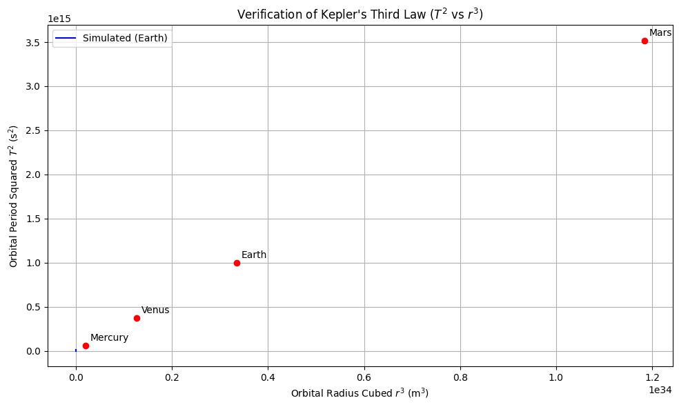
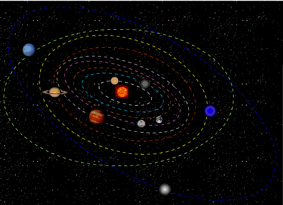

# Gravity

## Problem 1: Orbital Period and Orbital Radius

### Motivation

The relationship between the square of the orbital period and the cube of the orbital radius, known as **Kepler's Third Law**, is a cornerstone of celestial mechanics.

- It connects **orbital dynamics** to **gravitational forces**
- Crucial for:
  - Determining planetary motion
  - Designing satellite trajectories
  - Estimating masses of celestial objects

---

### Task

- Derive the relationship between:
  - Orbital period $T$
  - Orbital radius $r$
- Use Newton's Law of Gravitation and centripetal force
- Apply the law to real-world cases like:
  - Moon's orbit around Earth
  - Planets in the Solar System
- Simulate circular orbits to verify the relation

---

## Derivation

**Step 1: Newton's Law of Universal Gravitation**

$$F_g = \frac{GMm}{r^2}$$

**Step 2: Centripetal Force Required for Circular Motion**

$$F_c = \frac{mv^2}{r}$$

**Equating gravitational force and centripetal force**:

$$\frac{GMm}{r^2} = \frac{mv^2}{r}$$

Cancel $m$ and rearrange:

$$v^2 = \frac{GM}{r}$$

**Step 3: Express velocity in terms of period $T$**

Orbital speed $v = \frac{2\pi r}{T}$

Substitute into the equation:

$$\left(\frac{2\pi r}{T}\right)^2 = \frac{GM}{r}$$

Expand and simplify:

$$\frac{4\pi^2 r^2}{T^2} = \frac{GM}{r}$$

Multiply both sides by $T^2 r$:

$$4\pi^2 r^3 = GMT^2$$

Finally:

$$T^2 = \frac{4\pi^2}{GM} r^3$$

---

## Implications

- **Kepler's Third Law**: $T^2 \propto r^3$
- This relation:
  - Helps determine the **mass of the central object**
  - Predicts motion of satellites and moons
  - Useful for **astro-navigation** and **space missions**

---

## Real-World Example: The Moon

- Mass of Earth: $M = 5.97 \times 10^{24}$ kg  
- Radius of Moon's orbit: $r = 3.84 \times 10^8$ m

Using:

$$T = 2\pi \sqrt{\frac{r^3}{GM}}$$

---

## Python Simulation


---
```python
import numpy as np
import matplotlib.pyplot as plt

# Constants
G = 6.67430e-11  # Gravitational constant (m^3 kg^-1 s^-2)
pi = np.pi

# Planetary data for verification (orbital radius in meters, period in seconds)
planet_data = {
    "Mercury": {"r": 5.79e10, "T": 7.60e6},
    "Venus":   {"r": 1.082e11, "T": 1.94e7},
    "Earth":   {"r": 1.496e11, "T": 3.156e7},
    "Mars":    {"r": 2.279e11, "T": 5.93e7},
}

# Arrays for simulation
radii = np.linspace(1e7, 5e8, 200)  # Orbital radii in meters
M_earth = 5.97e24  # Mass of Earth in kg

# Kepler's Third Law simulation for Earth orbit
def orbital_period(r, M):
    return 2 * pi * np.sqrt(r**3 / (G * M))

# Calculate T^2 and r^3
T_sim = orbital_period(radii, M_earth)
T_squared_sim = T_sim**2
r_cubed_sim = radii**3

# Extract T^2 and r^3 from real planetary data
T_squared_planets = []
r_cubed_planets = []
labels = []

for planet, data in planet_data.items():
    T_squared_planets.append(data["T"]**2)
    r_cubed_planets.append(data["r"]**3)
    labels.append(planet)

# Estimate Mass of Sun using Kepler's Law (Earth data)
T_earth = planet_data["Earth"]["T"]
r_earth = planet_data["Earth"]["r"]
M_sun = 4 * pi**2 * r_earth**3 / (G * T_earth**2)

T_squared_planets = np.array(T_squared_planets)
r_cubed_planets = np.array(r_cubed_planets)

# Plotting
plt.figure(figsize=(10, 6))
plt.plot(r_cubed_sim, T_squared_sim, label="Simulated (Earth)", color="blue")
plt.scatter(r_cubed_planets, T_squared_planets, color="red", zorder=5)

# Annotate planet names
for i, planet in enumerate(labels):
    plt.annotate(planet, (r_cubed_planets[i], T_squared_planets[i]), textcoords="offset points", xytext=(5,5))

plt.title("Verification of Kepler's Third Law ($T^2$ vs $r^3$)")
plt.xlabel("Orbital Radius Cubed $r^3$ (m$^3$)")
plt.ylabel("Orbital Period Squared $T^2$ (s$^2$)")
plt.grid(True)
plt.legend()
plt.tight_layout()
plt.show()

M_sun, M_earth  # Output estimated mass of Sun and used Earth mass for verific
```

---
```python
import numpy as np
import matplotlib.pyplot as plt
from matplotlib.animation import FuncAnimation

# Orbital parameters (in astronomical units and years)
radius = 1           # Orbital radius in AU
period = 1           # Orbital period in years
omega = 2 * np.pi / period  # Angular velocity (rad/year)

# Time array (convert years to days)
t = np.linspace(0, period, 360)
x = radius * np.cos(omega * t * 365)  # X-position over time
y = radius * np.sin(omega * t * 365)  # Y-position over time

# Set up the figure and axis
fig, ax = plt.subplots(figsize=(6, 6))
ax.set_aspect('equal')
ax.set_xlim(-1.5, 1.5)
ax.set_ylim(-1.5, 1.5)
ax.set_title("Circular Planet Orbit (Kepler's 3rd Law)")
ax.set_xlabel("X (AU)")
ax.set_ylabel("Y (AU)")

# Draw the Sun and initialize the planet
sun = plt.Circle((0, 0), 0.05, color='gold', label='Sun')
planet, = plt.plot([], [], 'o', color='blue', label='Planet')
orbit, = plt.plot(x, y, linestyle='dotted', color='gray', alpha=0.5)

# Add the Sun to the plot
ax.add_artist(sun)
ax.legend(loc="upper right")

# Animation update function
def update(frame):
    # Modified to provide sequences to set_data
    planet.set_data([x[frame]], [y[frame]])  
    return planet,

# Create animation
ani = FuncAnimation(fig, update, frames=len(t), interval=30, blit=True)

plt.show()
```



