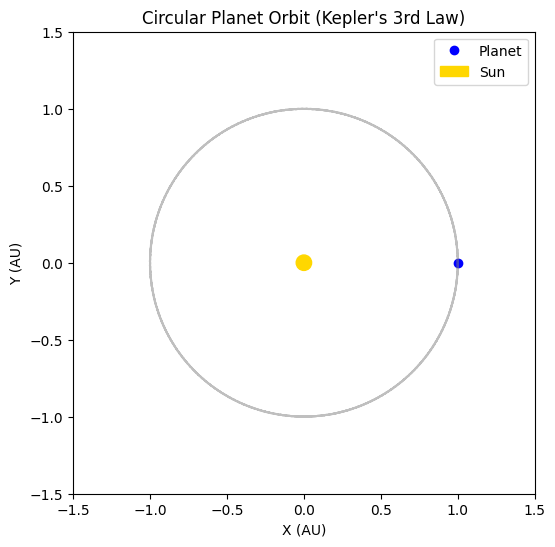

# Gravity

## Problem 1: Orbital Period and Orbital Radius

### Motivation

The relationship between the square of the orbital period and the cube of the orbital radius, known as **Kepler's Third Law**, is a cornerstone of celestial mechanics.

- It connects **orbital dynamics** to **gravitational forces**
- Crucial for:
  - Determining planetary motion
  - Designing satellite trajectories
  - Estimating masses of celestial objects

---

### Task

- Derive the relationship between:
  - Orbital period $T$
  - Orbital radius $r$
- Use Newton's Law of Gravitation and centripetal force
- Apply the law to real-world cases like:
  - Moon's orbit around Earth
  - Planets in the Solar System
- Simulate circular orbits to verify the relation

---

## Derivation

**Step 1: Newton's Law of Universal Gravitation**

$$F_g = \frac{GMm}{r^2}$$

**Step 2: Centripetal Force Required for Circular Motion**

$$F_c = \frac{mv^2}{r}$$

**Equating gravitational force and centripetal force**:

$$\frac{GMm}{r^2} = \frac{mv^2}{r}$$

Cancel $m$ and rearrange:

$$v^2 = \frac{GM}{r}$$

**Step 3: Express velocity in terms of period $T$**

Orbital speed $v = \frac{2\pi r}{T}$

Substitute into the equation:

$$\left(\frac{2\pi r}{T}\right)^2 = \frac{GM}{r}$$

Expand and simplify:

$$\frac{4\pi^2 r^2}{T^2} = \frac{GM}{r}$$

Multiply both sides by $T^2 r$:

$$4\pi^2 r^3 = GMT^2$$

Finally:

$$T^2 = \frac{4\pi^2}{GM} r^3$$

---
Sure! Here's a short academic-style note summarizing what was done:

---

## 📘 Summary Note: Estimating Mass of Earth and Sun Using Kepler’s Third Law

This document provides a **manual derivation and computation** of the **mass of the Earth and the Sun** using **Kepler's Third Law**:

* We used the formula:

  $$
  M = \frac{4\pi^2 r^3}{G T^2}
  $$

  which relates a satellite’s orbital period (\$T\$) and radius (\$r\$) to the central body's mass (\$M\$).

* For the **Earth**, we used:

  * Orbital altitude of 400 km,
  * Period \$T = 5400\$ s,
  * Earth radius \$R = 6.371 \times 10^6\$ m,
  * Result:
    $M_{Earth} \approx 6.32 \times 10^{24}\ \text{kg}$

* For the **Sun**, we used:

  * Earth-Sun distance: \$1.496 \times 10^{11}\$ m,
  * Period \$T = 1\$ year,
  * Result:
    $M_{Sun} \approx 1.99 \times 10^{30}\ \text{kg}$


## Implications

- **Kepler's Third Law**: $T^2 \propto r^3$
- This relation:
  - Helps determine the **mass of the central object**
  - Predicts motion of satellites and moons
  - Useful for **astro-navigation** and **space missions**

---

## Real-World Example: The Moon

- Mass of Earth: $M = 5.97 \times 10^{24}$ kg  
- Radius of Moon's orbit: $r = 3.84 \times 10^8$ m

Using:

$$T = 2\pi \sqrt{\frac{r^3}{GM}}$$

---

## Python Simulation


---
```python
import numpy as np
import matplotlib.pyplot as plt
import pandas as pd

planets = {
    'Mercury': {'r': 57.9e6, 'T': 0.241},
    'Venus': {'r': 108.2e6, 'T': 0.615},
    'Earth': {'r': 149.6e6, 'T': 1.000},
    'Mars': {'r': 227.9e6, 'T': 1.881}
}

data = {
    'Planet': [],
    'r (10^6 km)': [],
    'T (years)': [],
    'r³ (10^18 km³)': [],
    'T² (years²)': []
}

for name, values in planets.items():
    r = values['r']
    T = values['T']
    data['Planet'].append(name)
    data['r (10^6 km)'].append(r)
    data['T (years)'].append(T)
    data['r³ (10^18 km³)'].append((r**3) / 1e18)
    data['T² (years²)'].append(T**2)

df = pd.DataFrame(data)

print(df)

plt.plot(df['r³ (10^18 km³)'], df['T² (years²)'], 'ro-', markersize=8)
for i, txt in enumerate(df['Planet']):
    plt.annotate(txt, (df['r³ (10^18 km³)'][i], df['T² (years²)'][i]), textcoords="offset points", xytext=(5,5), ha='center')

plt.xlabel(r'$r^3$ (in $10^{18}\ km^3$)')
plt.ylabel(r'$T^2$ (in $years^2$)')
plt.title('Verification of Kepler\'s Third Law with Solar System Planets')
plt.grid(True)
plt.show()

```

---
```python
import numpy as np
import matplotlib.pyplot as plt
from matplotlib.animation import FuncAnimation

# Orbital parameters (in astronomical units and years)
radius = 1           # Orbital radius in AU
period = 1           # Orbital period in years
omega = 2 * np.pi / period  # Angular velocity (rad/year)

# Time array (convert years to days)
t = np.linspace(0, period, 360)
x = radius * np.cos(omega * t * 365)  # X-position over time
y = radius * np.sin(omega * t * 365)  # Y-position over time

# Set up the figure and axis
fig, ax = plt.subplots(figsize=(6, 6))
ax.set_aspect('equal')
ax.set_xlim(-1.5, 1.5)
ax.set_ylim(-1.5, 1.5)
ax.set_title("Circular Planet Orbit (Kepler's 3rd Law)")
ax.set_xlabel("X (AU)")
ax.set_ylabel("Y (AU)")

# Draw the Sun and initialize the planet
sun = plt.Circle((0, 0), 0.05, color='gold', label='Sun')
planet, = plt.plot([], [], 'o', color='blue', label='Planet')
orbit, = plt.plot(x, y, linestyle='dotted', color='gray', alpha=0.5)

# Add the Sun to the plot
ax.add_artist(sun)
ax.legend(loc="upper right")

# Animation update function
def update(frame):
    # Modified to provide sequences to set_data
    planet.set_data([x[frame]], [y[frame]])  
    return planet,

# Create animation
ani = FuncAnimation(fig, update, frames=len(t), interval=30, blit=True)

plt.show()
```


