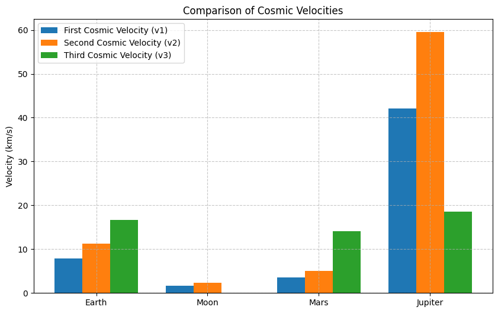
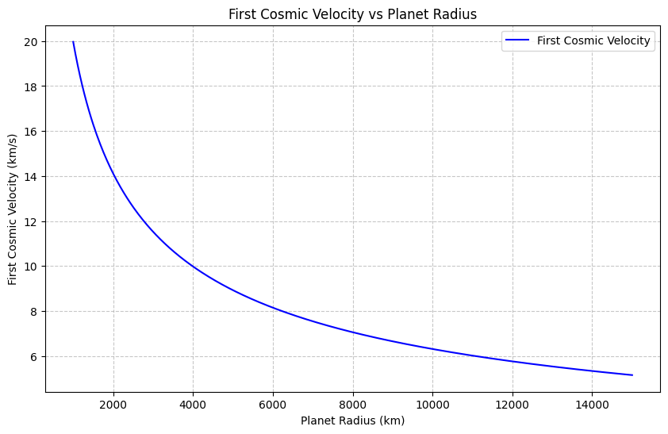
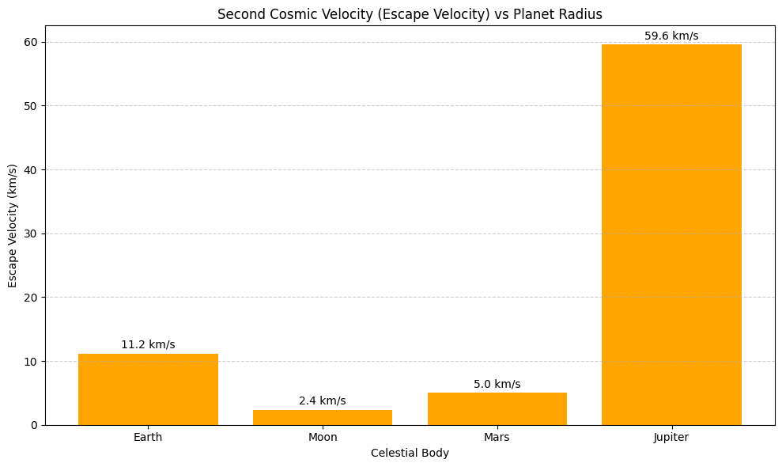
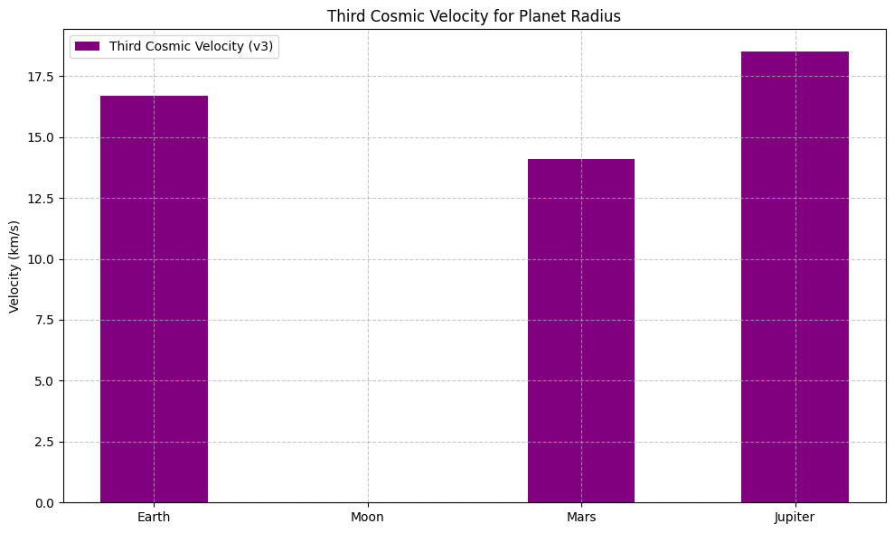
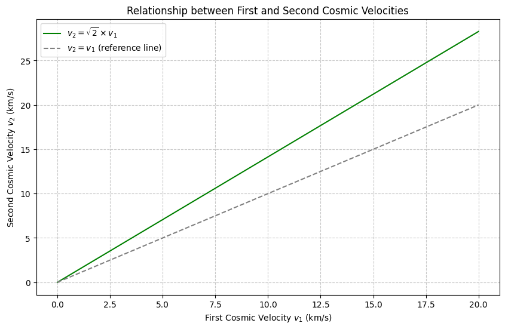

# 🌌 Gravity – Problem 2: The Three Cosmic Velocities

## 🎯 Objective

To derive and understand the three critical velocities in orbital mechanics — **First Cosmic Velocity (orbital velocity)**, **Second Cosmic Velocity (escape velocity)**, and **Third Cosmic Velocity (solar system escape)** — with calculations and comparisons for Earth, Moon, Mars, and Jupiter.

---

## 📘 Key Concepts

### 🌍 First Cosmic Velocity ($v_1$) — Orbital Velocity

- **Definition**: Minimum velocity required to maintain a circular orbit just above the surface of a celestial body.

- **Derivation**:

 The gravitational force provides the required centripetal force:
$$
\frac{G M m}{R^2} = \frac{m v_1^2}{R}
$$

Simplifying:
$$
v_1 = \sqrt{\frac{G M}{R}}
$$


---

### 🚀 Second Cosmic Velocity ($v_2$) — Escape Velocity

- **Definition**: Minimum velocity needed to escape the gravitational field of a body without further propulsion.

- **Derivation**:

  Set total mechanical energy to zero:
  $$
  \frac{1}{2}mv_2^2 - \frac{G M m}{R} = 0
  $$
  Solving:
  $$
  v_2 = \sqrt{\frac{2 G M}{R}} = \sqrt{2} \cdot v_1
  $$

---

### 🌞 Third Cosmic Velocity ($v_3$) — Solar System Escape

- **Definition**: Minimum velocity needed to escape the gravitational field of the Sun, starting from Earth's orbit.

- **Derivation** (relative to Sun, neglecting Earth's gravity):
  $$
  v_3 = \sqrt{\frac{2 G M_{sun}}{r_{earth\_orbit}}}
  $$

---

## 🌍 Earth: Numerical Values

Using:
- $G = 6.674 \times 10^{-11} \ \text{m}^3\text{kg}^{-1}\text{s}^{-2}$
- $M_{earth} = 5.97 \times 10^{24} \ \text{kg}$
- $R_{earth} = 6.371 \times 10^6 \ \text{m}$

- **First cosmic velocity**:
$$
v_1 = \sqrt{\frac{G M}{R}} \approx 7.91 \ \text{km/s}
$$

- **Second cosmic velocity**:
$$
v_2 = \sqrt{2} \cdot v_1 \approx 11.2 \ \text{km/s}
$$

- **Third cosmic velocity** (escape from Sun at Earth’s orbit):
$$
v_3 = \sqrt{\frac{2 G M_{sun}}{r_{earth\_orbit}}} \approx 42.1 \ \text{km/s}
$$


---

## 🌐 Comparison Table

| Body     | Radius (m)         | Mass (kg)           | $v_1$ (km/s) | $v_2$ (km/s) |
|----------|--------------------|----------------------|--------------|--------------|
| Earth    | $6.371 \times 10^6$ | $5.97 \times 10^{24}$ | 7.91         | 11.2         |
| Moon     | $1.74 \times 10^6$  | $7.35 \times 10^{22}$ | 1.68         | 2.38         |
| Mars     | $3.39 \times 10^6$  | $6.42 \times 10^{23}$ | 3.55         | 5.03         |
| Jupiter  | $7.15 \times 10^7$  | $1.90 \times 10^{27}$ | 42.1         | 59.5         |

---

## 📊 Visualization Ideas

- **Bar Chart**: Compare $v_1$ and $v_2$ for Earth, Moon, Mars, and Jupiter.
- **Orbit Diagram**: Visualize scale and escape paths.
- **Energy Diagram**: Show kinetic vs potential energy during escape.

---

## 📎 Notes

- Third cosmic velocity ($v_3$) assumes an object escapes directly from Earth’s orbit from the Sun — not from the Earth's surface.
- Actual mission trajectories involve complex gravity assists and slingshots.

---

## 📚 Further Reading

- [NASA Solar System Dynamics](https://ssd.jpl.nasa.gov/)
- Fundamentals of Astrodynamics – Bate, Mueller, White


---
```python
import matplotlib.pyplot as plt

# Data
bodies = ['Earth', 'Moon', 'Mars', 'Jupiter']
v1 = [7.9, 1.68, 3.55, 42.1]
v2 = [11.2, 2.38, 5.03, 59.5]
v3 = [16.7, None, 14.1, 18.5]  # Moon doesn't have v3 in same sense

x = range(len(bodies))

# Plot
plt.figure(figsize=(10, 6))
plt.bar(x, v1, width=0.25, label='First Cosmic Velocity (v1)', align='center')
plt.bar([i + 0.25 for i in x], v2, width=0.25, label='Second Cosmic Velocity (v2)', align='center')
plt.bar([i + 0.5 for i in x], [v if v else 0 for v in v3], width=0.25, label='Third Cosmic Velocity (v3)', align='center')

plt.xticks([i + 0.25 for i in x], bodies)
plt.ylabel('Velocity (km/s)')
plt.title('Comparison of Cosmic Velocities')
plt.legend()
plt.grid(True, linestyle='--', alpha=0.7)
plt.show()
```

---
```python
import numpy as np
import matplotlib.pyplot as plt

# Constants
G = 6.67430e-11  # gravitational constant in m^3 kg^-1 s^-2
M = 5.972e24     # mass of Earth in kg (we'll keep it constant for this graph)

# Generate a range of planet radii (in meters)
radii = np.linspace(1e6, 1.5e7, 500)  # from 1000 km to 15000 km

# Calculate first cosmic velocity for each radius
v1 = np.sqrt(G * M / radii)

# Convert velocity to km/s
v1_km_s = v1 / 1000

# Plotting
plt.figure(figsize=(10,6))
plt.plot(radii/1000, v1_km_s, label='First Cosmic Velocity', color='blue')  # radii in km
plt.xlabel('Planet Radius (km)')
plt.ylabel('First Cosmic Velocity (km/s)')
plt.title('First Cosmic Velocity vs Planet Radius')
plt.grid(True, linestyle='--', alpha=0.7)
plt.legend()
plt.show()
```

---
```python
import numpy as np
import matplotlib.pyplot as plt

# Gravitational constant (m^3 kg^-1 s^-2)
G = 6.67430e-11

# Planetary data: Radius (m), Mass (kg)
bodies = {
    "Earth":   {"R": 6.371e6,  "M": 5.97e24},
    "Moon":    {"R": 1.74e6,   "M": 7.35e22},
    "Mars":    {"R": 3.39e6,   "M": 6.42e23},
    "Jupiter": {"R": 7.15e7,   "M": 1.90e27}
}

# Calculate second cosmic velocity (v2) for each body
radii = []
v2_values = []
labels = []

for body, data in bodies.items():
    R = data["R"]
    M = data["M"]
    v2 = np.sqrt(2 * G * M / R) / 1000  # Convert to km/s
    radii.append(R / 1e6)  # Convert radius to millions of kilometers
    v2_values.append(v2)
    labels.append(body)

# Plotting: Second Cosmic Velocity vs Planet Radius (only second velocity)
plt.figure(figsize=(10, 6))

# Create bar plot for escape velocity (v2)
plt.bar(labels, v2_values, color='orange')

# Adding title and labels
plt.title("Second Cosmic Velocity (Escape Velocity) vs Planet Radius")
plt.xlabel("Celestial Body")
plt.ylabel("Escape Velocity (km/s)")

# Annotating bars with values for escape velocity
for i, value in enumerate(v2_values):
    plt.text(i, value + 0.5, f"{value:.1f} km/s", ha='center', va='bottom')

plt.grid(axis='y', linestyle='--', alpha=0.6)
plt.tight_layout()
plt.show()
```

---
```python
import matplotlib.pyplot as plt

# Data for celestial bodies and their third cosmic velocities (km/s)
bodies = ['Earth', 'Moon', 'Mars', 'Jupiter']
v3 = [16.7, None, 14.1, 18.5]  # Third Cosmic Velocity (v3), None for Moon as it doesn't apply

x = range(len(bodies))

# Plotting the bar chart for third cosmic velocity
plt.figure(figsize=(10, 6))

# Third Cosmic Velocity (v3), None for Moon, replace None with 0 for the plot
plt.bar(x, [v if v else 0 for v in v3], width=0.5, label='Third Cosmic Velocity (v3)', color='purple', align='center')

# Set x-ticks to be the body names
plt.xticks(x, bodies)

# Adding labels and title
plt.ylabel('Velocity (km/s)')
plt.title('Third Cosmic Velocity for Planet Radius')

# Adding a legend
plt.legend()

# Grid for better visualization
plt.grid(True, linestyle='--', alpha=0.7)

# Show the plot
plt.tight_layout()
plt.show()
```

---
```python
import numpy as np
import matplotlib.pyplot as plt

# Define a range of first cosmic velocities (v1) in km/s
v1 = np.linspace(0, 20, 500)

# Calculate second cosmic velocities (v2)
v2 = np.sqrt(2) * v1

# Plotting
plt.figure(figsize=(10,6))
plt.plot(v1, v2, label=r'$v_2 = \sqrt{2} \times v_1$', color='green')
plt.plot(v1, v1, linestyle='--', color='gray', label=r'$v_2 = v_1$ (reference line)')

plt.xlabel('First Cosmic Velocity $v_1$ (km/s)')
plt.ylabel('Second Cosmic Velocity $v_2$ (km/s)')
plt.title('Relationship between First and Second Cosmic Velocities')
plt.grid(True, linestyle='--', alpha=0.7)
plt.legend()
plt.show()
```