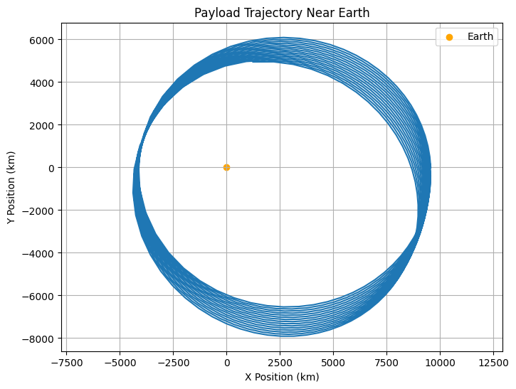
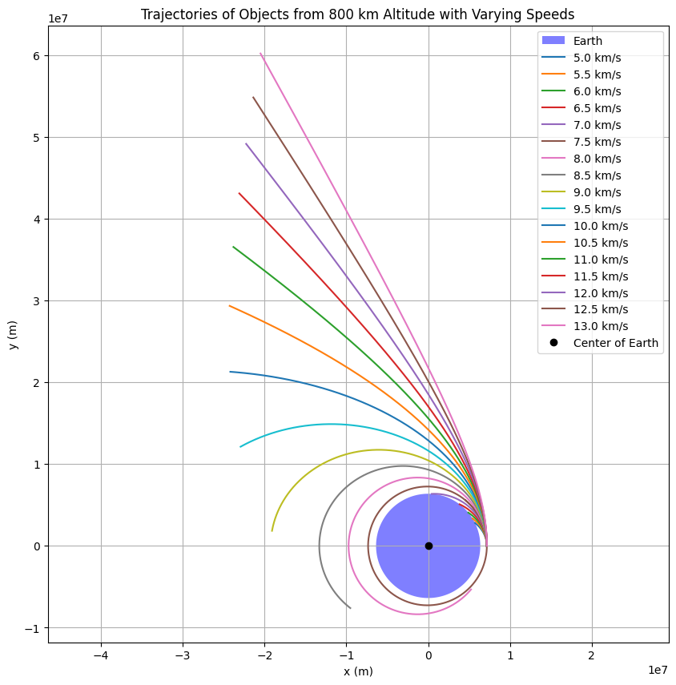

# Problem 3: Trajectories of a Freely Released Payload Near Earth

## **Motivation**

When an object is released from a moving rocket near Earth, its trajectory depends on initial conditions and gravitational forces. This scenario blends principles of orbital mechanics and numerical methods. Understanding the possible trajectories (parabolic, hyperbolic, elliptical) of such a payload is vital for space missions, such as deploying payloads or returning objects to Earth.

### **Task Overview**
- Analyze the possible trajectories of a payload released near Earth (parabolic, hyperbolic, elliptical).
- Perform a numerical analysis to compute the path of the payload based on given initial conditions (position, velocity, and altitude).
- Discuss how these trajectories relate to orbital insertion, reentry, or escape scenarios.
- Develop a computational tool to simulate and visualize the motion of the payload under Earth's gravity, accounting for initial velocities and directions.

## **Gravitational Forces and Trajectory Analysis**

### **Fundamental Equations**

1. **Gravitational Force:**
   The force between two masses is given by Newton's Law of Gravitation:

   $$
   F = \frac{G M m}{r^2}
   $$

   Where:
   - $F$ is the gravitational force.
   - $G$ is the gravitational constant.
   - $M$ is the mass of the Earth.
   - $m$ is the mass of the payload.
   - $r$ is the distance between the payload and the center of the Earth.

2. **Potential Energy:**
   The gravitational potential energy is:

   $$
   U = - \frac{G M m}{r}
   $$

3. **Kinetic Energy:**
   The kinetic energy is:

   $$
   K = \frac{1}{2} m v^2
   $$

4. **Total Energy:**
   The total energy of the system is the sum of kinetic and potential energies:

   $$
   E_{\text{total}} = K + U = \frac{1}{2} m v^2 - \frac{G M m}{r}
   $$

   Depending on the value of $E_{\text{total}}$, the trajectory of the payload can be:
   - **Elliptical:** If $E_{\text{total}} < 0$.
   - **Parabolic:** If $E_{\text{total}} = 0$.
   - **Hyperbolic:** If $E_{\text{total}} > 0$.

### **Numerical Methods for Simulation**

To simulate the trajectory, we need to solve the following set of equations using numerical methods like Euler's method or Runge-Kutta method:

1. **Position and Velocity Equations:**
   - Newton's second law: $F = ma$.
   - For a moving object in two dimensions, we can write:
     - $\ddot{x} = - \frac{G M x}{(x^2 + y^2)^{3/2}}$
     - $\ddot{y} = - \frac{G M y}{(x^2 + y^2)^{3/2}}$

Where:
- $(x, y)$ are the position coordinates of the payload.
- $\ddot{x}$ and $\ddot{y}$ are the accelerations in the $x$ and $y$ directions.

2. **Initial Conditions:**
   - Initial position $(x_0, y_0)$.
   - Initial velocity $(v_{x0}, v_{y0})$.

### **Simulating the Trajectories:**

We'll implement the simulation using Python and visualize the resulting trajectories.

## **Python Code for Trajectory Simulation**

---
```python
import numpy as np
import matplotlib.pyplot as plt

# Constants
G = 6.67430e-11  # Gravitational constant (m^3 kg^-1 s^-2)
M = 5.97e24  # Mass of Earth (kg)
radius_earth = 6.371e6  # Radius of Earth (m)

# Time parameters
dt = 100  # Time step (seconds)
T = 3600 * 24  # Total time of simulation (1 day)

# Initial conditions: (initial position, initial velocity)
initial_conditions = {
    'x0': 1.5 * radius_earth,  # 1.5 Earth radii from Earth's center (m)
    'y0': 0,  # Along the x-axis (horizontal direction)
    'vx0': 0,  # Initial velocity in x-direction (m/s)
    'vy0': 5000  # Initial velocity in y-direction (m/s)
}

# Function to compute acceleration due to gravity
def gravity_acceleration(x, y):
    r = np.sqrt(x**2 + y**2)  # Distance from Earth's center
    a = -G * M / r**2  # Gravitational acceleration
    ax = a * x / r  # Acceleration in x-direction
    ay = a * y / r  # Acceleration in y-direction
    return ax, ay

# Initialize position and velocity arrays
x, y = [initial_conditions['x0']], [initial_conditions['y0']]
vx, vy = [initial_conditions['vx0']], [initial_conditions['vy0']]

# Numerical integration using Euler's method
for t in np.arange(0, T, dt):
    ax, ay = gravity_acceleration(x[-1], y[-1])  # Get acceleration at current position
    # Update velocities
    vx.append(vx[-1] + ax * dt)
    vy.append(vy[-1] + ay * dt)
    # Update positions
    x.append(x[-1] + vx[-1] * dt)
    y.append(y[-1] + vy[-1] * dt)

# Convert the results into numpy arrays for easier plotting
x = np.array(x)
y = np.array(y)

# Plot the trajectory
plt.figure(figsize=(8, 6))
plt.plot(x / 1e3, y / 1e3)  # Convert to km for visualization
plt.scatter([0], [0], color='orange', label='Earth')  # Plot Earth at origin
plt.title('Payload Trajectory Near Earth')
plt.xlabel('X Position (km)')
plt.ylabel('Y Position (km)')
plt.grid(True)
plt.legend()
plt.axis('equal')
plt.show()
```

---
```python
import numpy as np
import matplotlib.pyplot as plt

# Constants
G = 6.67430e-11  # gravitational constant
M = 5.972e24     # mass of Earth
R = 6.371e6      # radius of Earth in meters
altitude = 800e3 # 800 km above the surface
initial_distance = R + altitude
time_step = 1    # seconds
total_time = 7000  # simulate up to 7000 seconds
n_steps = int(total_time / time_step)

# Initial velocities in m/s
velocities = np.arange(5000, 13500, 500)  # from 5 km/s to 13 km/s

# Create Earth plot
plt.figure(figsize=(10, 10))
theta = np.linspace(0, 2*np.pi, 300)
earth_x = R * np.cos(theta)
earth_y = R * np.sin(theta)
plt.fill(earth_x, earth_y, 'blue', alpha=0.5, label='Earth')

# Function to compute gravity acceleration
def gravity(pos):
    r = np.linalg.norm(pos)
    return -G * M * pos / r**3

# Simulate each trajectory
for v in velocities:
    pos = np.array([initial_distance, 0.0])
    vel = np.array([0.0, v])
    traj = []
    for _ in range(n_steps):
        acc = gravity(pos)
        vel += acc * time_step
        pos += vel * time_step
        traj.append(pos.copy())
        if np.linalg.norm(pos) <= R:
            break
    traj = np.array(traj)
    plt.plot(traj[:, 0], traj[:, 1], label=f'{v/1000:.1f} km/s')

# Plot settings
plt.plot(0, 0, 'ko', label='Center of Earth')
plt.axis('equal')
plt.xlabel('x (m)')
plt.ylabel('y (m)')
plt.title('Trajectories of Objects from 800 km Altitude with Varying Speeds')
plt.legend()
plt.grid(True)
plt.show()
```
