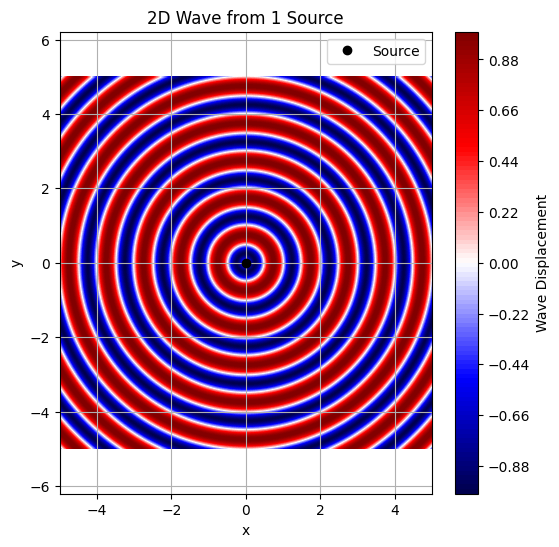
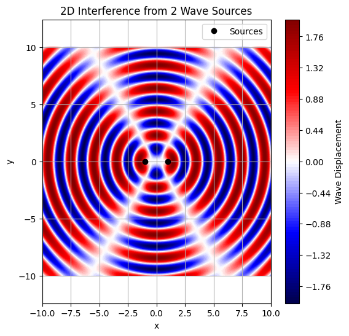

# 🌊 Interference Patterns of Circular Water Waves from Point Sources

## 🔹 Task Description

A **circular wave** on the water surface, emanating from a point source located at $(x_0, y_0)$, is described by the **Single Disturbance Equation**:

$$
\eta(x, y, t) = \frac{A}{\sqrt{r}} \cdot \cos(kr - \omega t + \phi)
$$

### Where:
- $\eta(x, y, t)$: Displacement of the water surface at point $(x, y)$ and time $t$
- $A$: Amplitude of the wave
- $k = \frac{2\pi}{\lambda}$: Wave number, with $\lambda$ as the wavelength
- $\omega = 2\pi f$: Angular frequency, with $f$ as the wave frequency
- $r = \sqrt{(x - x_0)^2 + (y - y_0)^2}$: Distance from source to the point $(x, y)$
- $\phi$: Initial phase of the wave

---

## ❓ Problem Statement

Your task is to **analyze the interference patterns** on the water surface caused by the **superposition of waves** emitted from point sources placed at the **vertices of a regular polygon**.

---

## ✅ Steps to Follow

### 1. Select a Regular Polygon
Choose a regular polygon:
- Equilateral Triangle (3 vertices)
- Square (4 vertices)
- Regular Pentagon (5 vertices)
- etc.

### 2. Position the Sources
Place wave sources at the **vertices** of the polygon. For a polygon centered at the origin:
- Let the radius be $R$
- The $i^{th}$ vertex is at:
  
  $$
  (x_i, y_i) = \left(R\cos\left(\frac{2\pi i}{N}\right), R\sin\left(\frac{2\pi i}{N}\right)\right)
  $$

### 3. Write the Wave Equations
Each source emits a wave described by:

$$
\eta_i(x, y, t) = \frac{A}{\sqrt{r_i}} \cdot \cos(k r_i - \omega t + \phi)
$$

Where:
- $r_i = \sqrt{(x - x_i)^2 + (y - y_i)^2}$

### 4. Superposition of Waves
The total displacement at a point $(x, y)$ and time $t$ is given by:

$$
\eta_{\text{sum}}(x, y, t) = \sum_{i=1}^{N} \eta_i(x, y, t)
$$

Where:
- $N$ is the number of sources (polygon vertices)

---

## 🔬 Analyze Interference Patterns

- Compute $\eta_{\text{sum}}(x, y, t)$ over a grid of $(x, y)$ points for a fixed time $t$
- Identify:
  - **Constructive interference**: Wave amplitudes add up (bright/fringe regions)
  - **Destructive interference**: Wave amplitudes cancel (dark/null regions)

---

## 📊 Visualization

- Use 2D heatmaps or 3D surface plots
- Plot $\eta_{\text{sum}}(x, y, t)$ over a defined region
- Observe symmetrical patterns based on the chosen polygon

---

## 🧠 Optional Enhancements

- Animate $\eta_{\text{sum}}(x, y, t)$ over time
- Explore effects of:
  - Changing phase $\phi$
  - Different frequencies $\omega$
  - Different polygon types

---

.gif>)
---
```python
import numpy as np
import matplotlib.pyplot as plt
from mpl_toolkits.mplot3d import Axes3D
from matplotlib import animation
from IPython.display import Image
from google.colab import files
 
# Parameters
A = 1.0  # Amplitude
k = 2 * np.pi / 1.0  # Wave number
omega = 1.0  # Angular frequency
phi = 0.0  # Initial phase
 
# Define triangle's vertices
sources = np.array([
    [0, np.sqrt(3)],  # Top vertex
    [-1, 0],          # Bottom-left
    [1, 0]            # Bottom-right
])
 
# Create a smaller grid
x = np.linspace(-2, 2, 50)
y = np.linspace(-2, 2, 50)
X, Y = np.meshgrid(x, y)
 
# Wave equation for a single source
def wave(X, Y, x0, y0, t):
    r = np.sqrt((X - x0)**2 + (Y - y0)**2)
    r = np.maximum(r, 1e-10)  # Avoid division by zero
    return (A / np.sqrt(r)) * np.cos(k * r - omega * t + phi)
 
# Compute total wave
def get_total_wave(t):
    eta_total = np.zeros_like(X)
    for x0, y0 in sources:
        eta_total += wave(X, Y, x0, y0, t)
    return eta_total
 
# 2D Plot and Animation
fig2d, ax2d = plt.subplots(figsize=(8, 6))
contour = ax2d.contourf(X, Y, get_total_wave(0), levels=50, cmap='seismic')
plt.colorbar(contour, ax=ax2d, label='Wave Displacement')
ax2d.scatter(sources[:, 0], sources[:, 1], c='black', marker='o', label='Sources')
ax2d.set_title('Interference Pattern (2D)')
ax2d.set_xlabel('x')
ax2d.set_ylabel('y')
ax2d.legend()
ax2d.grid(True)
 
def update_2d(frame):
    t = frame * 0.05
    ax2d.clear()
    eta_total = get_total_wave(t)
    contour = ax2d.contourf(X, Y, eta_total, levels=50, cmap='seismic')
    ax2d.scatter(sources[:, 0], sources[:, 1], c='black', marker='o', label='Sources')
    ax2d.set_title(f'Interference Pattern (2D, t={t:.2f})')
    ax2d.set_xlabel('x')
    ax2d.set_ylabel('y')
    ax2d.legend()
    ax2d.grid(True)
    return [contour]  # Return the QuadContourSet object as a list
 
ani2d = animation.FuncAnimation(fig2d, update_2d, frames=50, interval=50, blit=False)
writer2d = animation.PillowWriter(fps=10)  # Use PillowWriter for GIF
ani2d.save('triangle_interference_2d.gif', writer=writer2d)
plt.close(fig2d)
 
# 3D Plot and Animation
fig3d = plt.figure(figsize=(8, 6))
ax3d = fig3d.add_subplot(111, projection='3d')
eta_total = get_total_wave(0)
surf = ax3d.plot_surface(X, Y, eta_total, cmap='seismic')
fig3d.colorbar(surf, ax=ax3d, label='Wave Displacement')
ax3d.set_title('Interference Pattern (3D)')
ax3d.set_xlabel('x')
ax3d.set_ylabel('y')
ax3d.set_zlabel('Wave Displacement')
 
def update_3d(frame):
    t = frame * 0.05
    ax3d.clear()
    eta_total = get_total_wave(t)
    surf = ax3d.plot_surface(X, Y, eta_total, cmap='seismic')
    ax3d.set_title(f'Interference Pattern (3D, t={t:.2f})')
    ax3d.set_xlabel('x')
    ax3d.set_ylabel('y')
    ax3d.set_zlabel('Wave Displacement')
    return [surf]
 
ani3d = animation.FuncAnimation(fig3d, update_3d, frames=50, interval=50, blit=False)
writer3d = animation.PillowWriter(fps=10)  # Use PillowWriter for GIF
ani3d.save('triangle_interference_3d.gif', writer=writer3d)
plt.close(fig3d)
 
# Display GIFs inline
print("2D Animation:")
display(Image(filename='triangle_interference_2d.gif'))
print("3D Animation:")
display(Image(filename='triangle_interference_3d.gif'))
 
# Optionally download GIFs
files.download('triangle_interference_2d.gif')
files.download('triangle_interference_3d.gif')
```

---
```python
import numpy as np
import matplotlib.pyplot as plt

# Grid setup
x = np.linspace(-5, 5, 500)
y = np.linspace(-5, 5, 500)
X, Y = np.meshgrid(x, y)

# Wave parameters
wavelength = 1
k = 2 * np.pi / wavelength   # wave number
f = 1                        # frequency
omega = 2 * np.pi * f        # angular frequency
t = 0.5                      # snapshot time

# Distance from source at origin
r = np.sqrt(X**2 + Y**2)

# Wave function: sin(kr - ωt)
wave = np.sin(k * r - omega * t)

# Plotting
plt.figure(figsize=(6,6))
plt.contourf(X, Y, wave, levels=100, cmap='seismic')
plt.plot(0, 0, 'ko', label='Source')
plt.colorbar(label='Wave Displacement')
plt.title('2D Wave from 1 Source')
plt.xlabel('x')
plt.ylabel('y')
plt.legend()
plt.axis('equal')
plt.grid(True)
plt.show()
```

---
```python
# Source positions
source1 = (-1, 0)
source2 = (1, 0)

# Distances from each source
r1 = np.sqrt((X - source1[0])**2 + (Y - source1[1])**2)
r2 = np.sqrt((X - source2[0])**2 + (Y - source2[1])**2)

# Wave functions
wave1 = np.sin(k * r1 - omega * t)
wave2 = np.sin(k * r2 - omega * t)

# Superposed wave
wave_total = wave1 + wave2

# Plotting
plt.figure(figsize=(6,6))
plt.contourf(X, Y, wave_total, levels=100, cmap='seismic')
plt.plot(*source1, 'ko')
plt.plot(*source2, 'ko', label='Sources')
plt.colorbar(label='Wave Displacement')
plt.title('2D Interference from 2 Wave Sources')
plt.xlabel('x')
plt.ylabel('y')
plt.legend()
plt.axis('equal')
plt.grid(True)
plt.show()
```

---
```python
import numpy as np
import matplotlib.pyplot as plt

# Create a 2D grid
x = np.linspace(-10, 10, 500)
y = np.linspace(-10, 10, 500)
X, Y = np.meshgrid(x, y)

# Wave parameters
k = 2 * np.pi / 2    # wave number (wavelength = 2)
omega = 2 * np.pi / 1  # angular frequency (period = 1)
t = 0                 # time snapshot

# Distances from two sources at (-3, 0) and (3, 0)
r1 = np.sqrt((X + 3)**2 + Y**2)
r2 = np.sqrt((X - 3)**2 + Y**2)

# Waves from both sources
wave1 = np.sin(k * r1 - omega * t)
wave2 = np.sin(k * r2 - omega * t)

# Superposition
total_wave = wave1 + wave2

# Plot
plt.figure(figsize=(6, 6))
plt.pcolormesh(X, Y, total_wave**2, shading='auto', cmap='plasma')
plt.colorbar(label='Intensity')
plt.title('Two Wave Sources (Interference Pattern)')
plt.xlabel('x')
plt.ylabel('y')
plt.gca().set_aspect('equal')
plt.show()
```