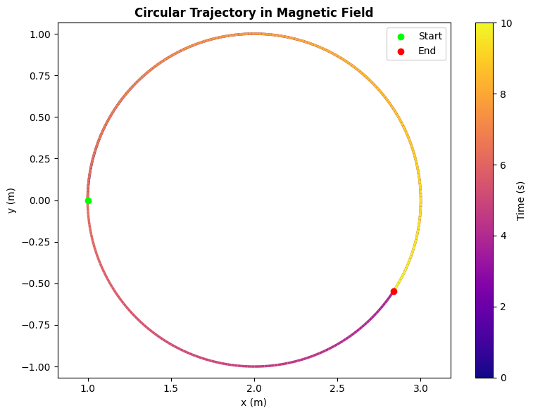
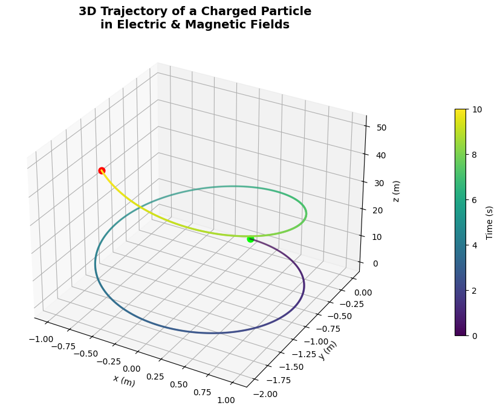
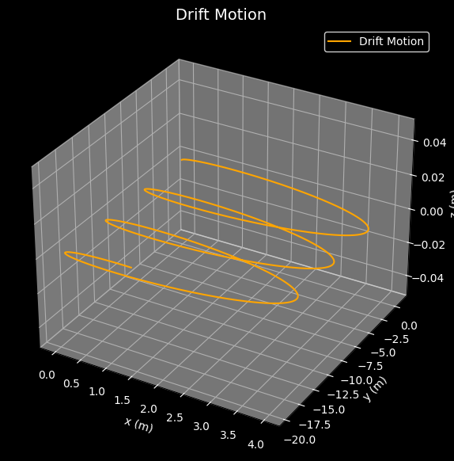

# Electromagnetism

## Problem 1: Simulating the Effects of the Lorentz Force

### Introduction:
The **Lorentz force** is the force experienced by a charged particle due to electromagnetic fields. It is a fundamental concept in electromagnetism and governs the behavior of particles in many physical systems. The force is given by the following equation:

$$
\mathbf{F} = q (\mathbf{E} + \mathbf{v} \times \mathbf{B})
$$

Where:
- $\mathbf{F}$ is the force on the particle,
- $q$ is the charge of the particle,
- $\mathbf{E}$ is the electric field,
- $\mathbf{v}$ is the velocity of the particle,
- $\mathbf{B}$ is the magnetic field.

The Lorentz force is responsible for the motion of charged particles in systems such as **particle accelerators**, **mass spectrometers**, **plasma confinement devices**, and **magnetic traps**. This task focuses on simulating the effects of this force on the motion of a particle under different electromagnetic field configurations.

### Physical Parameters:

To simplify the simulation and avoid subatomic-scale complexities, we define the following parameters for the charged particle:

- **Charge** $q = 1 \, \text{C}$: The charge of the particle is set to 1 Coulomb.
- **Mass** $m = 1 \, \text{g} = 1 \times 10^{-3} \, \text{kg}$: The particle’s mass is set to 1 gram.
- **Magnetic Field** $\mathbf{B} = [0, 0, 1] \, \text{T}$: A uniform magnetic field along the $z$-axis (1 Tesla).
- **Electric Field** $\mathbf{E} = [0, 0, 0] \, \text{V/m}$: Initially, no electric field is applied.
- **Initial Velocity** $\mathbf{v_0} = [1, 0, 0] \, \text{m/s}$: The particle starts with an initial velocity of 1 m/s along the $x$-axis.
- **Initial Position** $\mathbf{r_0} = [0, 0, 0] \, \text{m}$: The particle starts at the origin.

These parameters define the initial conditions for the simulation and are key to understanding how different configurations of electric and magnetic fields affect particle motion.

### Equations of Motion:

The Lorentz force law governs the motion of the particle. The equations of motion for a charged particle in electromagnetic fields are:

$$
\frac{d\mathbf{r}}{dt} = \mathbf{v}
$$

$$
\frac{d\mathbf{v}}{dt} = \frac{q}{m} \left( \mathbf{E} + \mathbf{v} \times \mathbf{B} \right)
$$

Where:
- $\mathbf{r}$ is the particle’s position,
- $\mathbf{v}$ is the particle’s velocity,
- $\mathbf{E}$ is the electric field,
- $\mathbf{B}$ is the magnetic field,
- $\mathbf{F}$ is the Lorentz force.

The first equation describes how the position of the particle changes over time, and the second equation governs the velocity change due to the Lorentz force. These differential equations are solved numerically to simulate the particle's trajectory over time.

### Scenarios and Trajectories:

#### 1. **Uniform Magnetic Field (Circular Motion):**
   - When only a magnetic field is present, the charged particle moves in a circular trajectory perpendicular to the magnetic field. The **Larmor radius** describes the radius of the circular path:

$$
r_L = \frac{m v_0}{q B}
$$

   - In this case, the velocity vector is always perpendicular to the magnetic field, and the motion is purely circular.

#### 2. **Combined Electric and Magnetic Fields (Helical Motion):**
   - When both electric and magnetic fields are applied, the particle will follow a helical path. The magnetic field causes the particle to move in a circular motion, while the electric field accelerates the particle along the field lines, resulting in a spiral trajectory.

#### 3. **Crossed Electric and Magnetic Fields (Drift Motion):**
   - If the electric and magnetic fields are perpendicular to each other, the particle will experience **drift motion**. In this scenario, the particle’s motion is governed by the **E × B drift**, where the particle moves with a constant drift velocity perpendicular to both fields.

#### 4. **Effect of Parameter Variations:**
   - The trajectory of the particle is sensitive to variations in the following parameters:
     - **Field Strengths**: Increasing the magnetic field strength $B$ leads to a smaller radius of curvature, while increasing the electric field strength $E$ will accelerate the particle.
     - **Initial Velocity**: A higher initial velocity $v_0$ results in larger, less curved paths.
     - **Particle Mass and Charge**: A larger mass results in a larger radius of curvature, while a larger charge leads to a stronger Lorentz force and thus a smaller radius.

### Visualization:

The simulation will produce 2D and 3D plots of the particle's trajectory for the different field configurations. Key features like the **Larmor radius** and **drift velocity** will be highlighted to visualize how these physical parameters influence the motion.

---

### Deliverables:

- **Markdown document** with detailed explanation and Python code for the simulation.
- **Visualizations** of particle trajectories in 2D and 3D for various scenarios (circular motion, helical motion, drift motion).
- A **discussion** on how the simulation results can be applied to practical systems like **cyclotrons**, **mass spectrometers**, and **magnetic confinement devices**.

---

---
```python
import numpy as np
import matplotlib.pyplot as plt
from scipy.integrate import solve_ivp
from matplotlib.collections import LineCollection

# === Constants ===
q = 1.0                          # Charge (C)
m = 1.0                          # Mass (kg)
E = np.array([0.0, 0.0, 0.0])    # Electric field (V/m)
B = np.array([0.0, 0.0, 1.0])    # Magnetic field (T)

# === Initial conditions ===
r0 = np.array([1.0, 0.0, 0.0])   # Initial position (m)
v0 = np.array([0.0, 1.0, 0.0])   # Initial velocity perpendicular to B (m/s)
y0 = np.concatenate((r0, v0))    # Combine position and velocity

# === Lorentz force differential equation ===
def lorentz(t, y):
    r = y[:3]
    v = y[3:]
    dvdt = (q / m) * (E + np.cross(v, B))
    return np.concatenate((v, dvdt))

# === Time setup ===
t_span = (0, 10)
t_eval = np.linspace(*t_span, 500)
sol = solve_ivp(lorentz, t_span, y0, t_eval=t_eval)
x, y = sol.y[0], sol.y[1]

# === Color gradient path ===
points = np.array([x, y]).T.reshape(-1, 1, 2)
segments = np.concatenate([points[:-1], points[1:]], axis=1)
norm = plt.Normalize(t_eval.min(), t_eval.max())
lc = LineCollection(segments, cmap='plasma', norm=norm)
lc.set_array(t_eval)
lc.set_linewidth(2.5)

# === Plot ===
fig, ax = plt.subplots(figsize=(8, 6))
ax.add_collection(lc)
ax.scatter(x[0], y[0], color='lime', label='Start', zorder=5)
ax.scatter(x[-1], y[-1], color='red', label='End', zorder=5)
ax.set_xlabel('x (m)')
ax.set_ylabel('y (m)')
ax.set_title('Circular Trajectory in Magnetic Field', weight='bold')
ax.axis('equal')
axcb = fig.colorbar(lc, ax=ax, label='Time (s)')
ax.legend()
plt.tight_layout()
plt.show()
```
.gif>)
---
```python
import numpy as np
import matplotlib.pyplot as plt
from matplotlib.animation import FuncAnimation, PillowWriter
from scipy.integrate import solve_ivp
from IPython.display import Image, display

# === Constants ===
q = 1.0                            # Charge (C)
m = 1.0                            # Mass (kg) — 1 gram = 0.001 kg
E = np.array([0.0, 0.0, 0.0])      # Electric field (V/m)
B = np.array([0.0, 0.0, 1.0])      # Magnetic field (T)

# === Initial Conditions ===
v0 = np.array([1.0, 0.0, 0.0])     # Velocity (m/s) 
r0 = np.array([0.0, 0.0, 0.0])     # Position (m)
y0 = np.concatenate((r0, v0))     # Combine initial state

# === Lorentz Force Function ===
def lorentz(t, y):
    r = y[:3]
    v = y[3:]
    dvdt = (q / m) * (E + np.cross(v, B))
    return np.concatenate((v, dvdt))

# === Time Settings ===
t_span = (0, 10)
t_eval = np.linspace(t_span[0], t_span[1], 500)
sol = solve_ivp(lorentz, t_span, y0, t_eval=t_eval)

x, y = sol.y[0], sol.y[1]   # only x and y components for 2D plot
z = sol.y[2]                # z component (flat in circular motion)

# === Set Up Plot ===
fig, ax = plt.subplots(figsize=(6, 6))
ax.set_xlim(np.min(x)*1.1, np.max(x)*1.1)
ax.set_ylim(np.min(y)*1.1, np.max(y)*1.1)
ax.set_xlabel("x (m)")
ax.set_ylabel("y (m)")
ax.set_title("Charged Particle Motion in 2D (x-y plane)")
ax.grid(True)

line, = ax.plot([], [], lw=2, color='dodgerblue')
point, = ax.plot([], [], 'ro')

# === Init Function ===
def init():
    line.set_data([], [])
    point.set_data([], [])
    return line, point

# === Update Function ===
def update(i):
    if i < len(x):
        line.set_data(x[:i+1], y[:i+1])
        point.set_data([x[i]], [y[i]])
    return line, point

# === Create Animation ===
ani = FuncAnimation(fig, update, frames=len(x), init_func=init, blit=False, interval=20)

# === Save to GIF ===
gif_path = "charged_particle_motion.gif"
writer = PillowWriter(fps=30)
ani.save(gif_path, writer=writer, dpi=100)
plt.close()

# === Display in Notebook (if using Jupyter/Colab) ===
display(Image(filename=gif_path))
```

---
```python
import numpy as np
import matplotlib.pyplot as plt
from scipy.integrate import solve_ivp
from mpl_toolkits.mplot3d import Axes3D
from matplotlib import cm

# Constants
q = 1.0
m = 1.0
E = np.array([0.0, 0.0, 1.0])
B = np.array([0.0, 0.0, 1.0])

# Initial conditions
v0 = np.array([1.0, 0.0, 0.0])
r0 = np.array([0.0, 0.0, 0.0])
y0 = np.concatenate((v0, r0))

# Lorentz force function
def lorentz(t, y):
    v = y[:3]
    r = y[3:]
    dvdt = (q / m) * (E + np.cross(v, B))
    return np.concatenate((dvdt, v))

# Solve system
t_span = (0, 10)
t_eval = np.linspace(*t_span, 1000)
sol = solve_ivp(lorentz, t_span, y0, t_eval=t_eval)
x, y, z = sol.y[3], sol.y[4], sol.y[5]

# 3D Plot
fig = plt.figure(figsize=(12, 7))
ax = fig.add_subplot(111, projection='3d')
ax.plot(x, y, z, lw=2, c='grey', alpha=0.3)

scatter = ax.scatter(x, y, z, c=sol.t, cmap='viridis', s=2)
ax.scatter(x[0], y[0], z[0], color='lime', label='Start', s=60)
ax.scatter(x[-1], y[-1], z[-1], color='red', label='End', s=60)

ax.set_xlabel('x (m)')
ax.set_ylabel('y (m)')
ax.set_zlabel('z (m)')
ax.set_title('3D Trajectory of a Charged Particle\nin Electric & Magnetic Fields',
             weight='bold', fontsize=14)
fig.colorbar(scatter, ax=ax, label='Time (s)', shrink=0.6, pad=0.1)
plt.tight_layout()
plt.show()
```

---
```python
import numpy as np
import matplotlib.pyplot as plt
from scipy.integrate import solve_ivp

# Constants
q = 1.0  # charge
m = 1.0  # mass
E = np.array([1.0, 0.0, 0.0])  # Electric field
B = np.array([0.0, 0.0, 1.0])  # Magnetic field

# Initial conditions
v0 = np.array([0.0, 1.0, 0.0])  # Initial velocity
r0 = np.array([0.0, 0.0, 0.0])  # Initial position
y0 = np.concatenate((v0, r0))

# Lorentz force equation
def lorentz(t, y):
    v = y[:3]
    r = y[3:]
    dvdt = (q / m) * (E + np.cross(v, B))
    return np.concatenate((dvdt, v))

# Time settings
t_span = (0, 20)
t_eval = np.linspace(*t_span, 2000)

# Solve the ODE
sol = solve_ivp(lorentz, t_span, y0, t_eval=t_eval)
x, y, z = sol.y[3], sol.y[4], sol.y[5]

# Plotting
fig = plt.figure(figsize=(10, 7))
ax = fig.add_subplot(111, projection='3d')
ax.set_facecolor('black')
fig.patch.set_facecolor('black')

# Plot the trajectory
ax.plot(x, y, z, color='orange', label='Drift Motion')

# Labels and style
ax.set_xlabel('x (m)', color='white')
ax.set_ylabel('y (m)', color='white')
ax.set_zlabel('z (m)', color='white')
ax.tick_params(colors='white')
ax.xaxis.label.set_color('white')
ax.yaxis.label.set_color('white')
ax.zaxis.label.set_color('white')
ax.legend(loc='upper right', facecolor='black', edgecolor='white', labelcolor='white')

# Adjust the grid and background
ax.grid(True, color='gray', linestyle='--', alpha=0.5)
plt.title("Drift Motion", color='white', fontsize=14)
plt.show()
```
