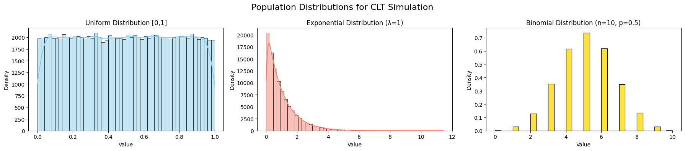
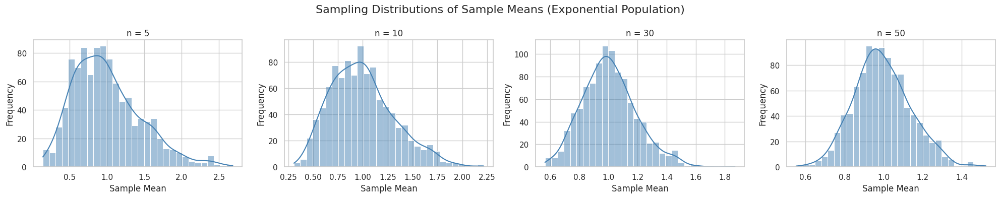
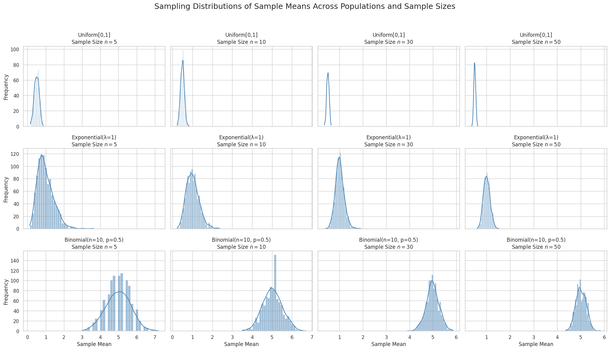
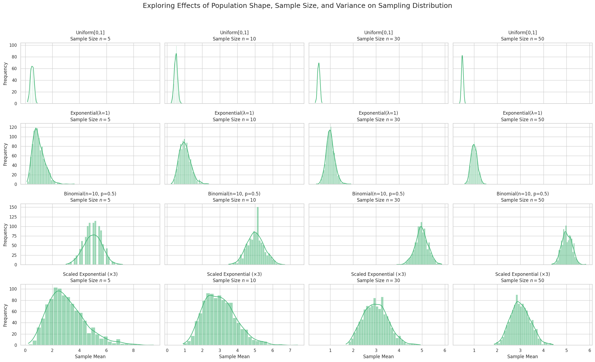

# Problem 1
# 🧪 Step 1: Setting Up Population Distributions

## 🎯 Objective

To simulate the **Central Limit Theorem (CLT)**, we begin by generating large populations from three distinct probability distributions:

- **Uniform Distribution**
- **Exponential Distribution**
- **Binomial Distribution**

Each population will have $N = 100{,}000$ data points to approximate a true underlying distribution.

---

## 📘 Theoretical Background

Before simulation, let us recall the **definitions** and **properties** of the chosen distributions:

---

### 1. Uniform Distribution

- Continuous distribution with equal probability across the range $$[a,b]$$
- Probability Density Function (PDF):  
  $$
  f(x)=\frac{1}{b-a},\quad \text{for } a\leq x\leq b
  $$
- Mean:  
  $$
  \mu=\frac{a+b}{2}
  $$
- Variance:  
  $$
  \sigma^2=\frac{(b-a)^2}{12}
  $$

---

### 2. Exponential Distribution

- Models the time between independent events (e.g., time between arrivals)
- PDF:  
  $$
  f(x)=\lambda e^{-\lambda x},\quad \text{for } x\geq 0
  $$
- Mean:  
  $$
  \mu=\frac{1}{\lambda}
  $$
- Variance:  
  $$
  \sigma^2=\frac{1}{\lambda^2}
  $$

---

### 3. Binomial Distribution

- Discrete distribution modeling number of successes in $$n$$ independent trials
- Probability Mass Function (PMF):  
  $$
  P(X=k)=\binom{n}{k}p^k(1-p)^{n-k}
  $$
- Mean:  
  $$
  \mu=np
  $$
- Variance:  
  $$
  \sigma^2=np(1-p)
  $$


---

---
```python
# 🧪 Step 1: Setting Up Population Distributions

# ✅ Required Libraries
import numpy as np
import matplotlib.pyplot as plt
import seaborn as sns

# Enable inline plotting (optional in Colab, but safe to include)
%matplotlib inline

# ✅ Simulation Parameters
np.random.seed(42)         # For reproducibility
N = 100_000                # Number of population data points

# --- Uniform Distribution ---
# Range: [0, 1]
uniform_pop = np.random.uniform(low=0, high=1, size=N)

# --- Exponential Distribution ---
# lambda = 1 → scale = 1
exponential_pop = np.random.exponential(scale=1.0, size=N)

# --- Binomial Distribution ---
# Parameters: n = 10, p = 0.5
binomial_pop = np.random.binomial(n=10, p=0.5, size=N)

# ✅ Plotting the Populations
fig, axs = plt.subplots(1, 3, figsize=(18, 4))

# Plot Uniform
sns.histplot(uniform_pop, bins=50, kde=True, ax=axs[0], color='skyblue')
axs[0].set_title('Uniform Distribution [0,1]')
axs[0].set_xlabel('Value')
axs[0].set_ylabel('Density')

# Plot Exponential
sns.histplot(exponential_pop, bins=50, kde=True, ax=axs[1], color='salmon')
axs[1].set_title('Exponential Distribution (λ=1)')
axs[1].set_xlabel('Value')
axs[1].set_ylabel('Density')

# Plot Binomial
sns.histplot(binomial_pop, bins=30, kde=False, stat="density", ax=axs[2], color='gold')
axs[2].set_title('Binomial Distribution (n=10, p=0.5)')
axs[2].set_xlabel('Value')
axs[2].set_ylabel('Density')

plt.suptitle("Population Distributions for CLT Simulation", fontsize=16)
plt.tight_layout()
plt.show()
```
# 🧮 Step 2: Simulating Sampling Distributions

## 🎯 Objective

To explore the **Central Limit Theorem (CLT)** by simulating the behavior of sample means drawn from different population distributions.

---

## 📘 Central Limit Theorem (CLT)

The **Central Limit Theorem** states:

> Given a population with mean $\mu$ and variance $\sigma^2$, the sampling distribution of the sample mean $\bar{X}$ becomes approximately normal as the sample size $n$ increases — regardless of the original population's shape.

Mathematically, if $X_1, X_2, ..., X_n$ are i.i.d. random variables with mean $\mu$ and variance $\sigma^2$, then the standardized sample mean:

$$
Z = \frac{\bar{X} - \mu}{\sigma/\sqrt{n}}
$$

converges in distribution to the standard normal distribution $N(0, 1)$ as $n \to \infty$.

---

## 🧪 Simulation Plan

We will:

- Choose a range of **sample sizes**: $n = 5, 10, 30, 50$
- For each $n$:
  - Draw a large number of samples (e.g., 1000)
  - Compute the sample mean for each sample
  - Collect all sample means to form the **sampling distribution**
- Plot histograms of these sampling distributions and observe convergence to normality

---

---
```python
import numpy as np
import matplotlib.pyplot as plt
import seaborn as sns

# Use seaborn styling
sns.set(style="whitegrid")

# Define population
N = 100_000
np.random.seed(42)
population = np.random.exponential(scale=1.0, size=N)

# Sample sizes to test
sample_sizes = [5, 10, 30, 50]
num_samples = 1000  # Number of samples per size

# Plotting
fig, axs = plt.subplots(1, len(sample_sizes), figsize=(20, 4))

for i, n in enumerate(sample_sizes):
    sample_means = []

    for _ in range(num_samples):
        sample = np.random.choice(population, size=n, replace=False)
        sample_means.append(np.mean(sample))

    sns.histplot(sample_means, bins=30, kde=True, ax=axs[i], color='steelblue')
    axs[i].set_title(f'n = {n}')
    axs[i].set_xlabel('Sample Mean')
    axs[i].set_ylabel('Frequency')

plt.suptitle('Sampling Distributions of Sample Means (Exponential Population)', fontsize=16)
plt.tight_layout()
plt.show()
```
# 📊 Step 3: Visualizing Sampling Distribution Results

## 🎯 Objective

- Plot histograms of the **sample means** for each population distribution and for various sample sizes.
- Observe the **rate of convergence** of these sampling distributions toward a normal distribution.
- Compare how the shape of the **original population distribution** affects convergence.

---

## 🔍 Theoretical Background

Recall the **Central Limit Theorem (CLT)**:

> For independent, identically distributed random variables $X_1, X_2, \ldots, X_n$ with mean $\mu$ and variance $\sigma^2$, the standardized sample mean

$$
Z = \frac{\bar{X} - \mu}{\sigma/\sqrt{n}}
$$

approaches a standard normal distribution $N(0,1)$ as sample size $n \to \infty$.

---

## 📌 Key Points to Observe

- Sampling distributions for **small $n$** retain the shape of the population.
- As $n$ increases, the sampling distributions become **more symmetric and bell-shaped**.
- The **speed of convergence** depends on the population distribution's:
  - **Skewness**
  - **Kurtosis**
  - **Variance**

---

---
```python
import numpy as np
import matplotlib.pyplot as plt
import seaborn as sns

sns.set(style="whitegrid")
np.random.seed(42)

# Population size
N = 100_000

# Generate populations
populations = {
    "Uniform[0,1]": np.random.uniform(0, 1, N),
    "Exponential(λ=1)": np.random.exponential(1, N),
    "Binomial(n=10, p=0.5)": np.random.binomial(n=10, p=0.5, size=N),
}

sample_sizes = [5, 10, 30, 50]
num_samples = 1000

fig, axes = plt.subplots(len(populations), len(sample_sizes), figsize=(20, 12), sharex='col', sharey='row')

for row_idx, (dist_name, population) in enumerate(populations.items()):
    for col_idx, n in enumerate(sample_sizes):
        sample_means = []
        for _ in range(num_samples):
            sample = np.random.choice(population, size=n, replace=False)
            sample_means.append(np.mean(sample))

        ax = axes[row_idx, col_idx]
        sns.histplot(sample_means, bins=30, kde=True, color='steelblue', ax=ax)
        ax.set_title(f"{dist_name}\nSample Size $n={n}$")
        if col_idx == 0:
            ax.set_ylabel('Frequency')
        if row_idx == len(populations)-1:
            ax.set_xlabel('Sample Mean')

plt.suptitle("Sampling Distributions of Sample Means Across Populations and Sample Sizes", fontsize=18)
plt.tight_layout(rect=[0, 0.03, 1, 0.95])
plt.show()
```
# 🔍 Step 4: Exploring Parameters Affecting the Central Limit Theorem

## 🎯 Objectives

- Analyze how the **shape of the original population distribution** influences the rate of convergence to normality.
- Investigate the impact of **sample size $n$** on the approximation to a normal distribution.
- Examine the role of **population variance $\sigma^2$** on the spread of the sampling distribution of the mean.

---

## 1. Effect of Population Distribution Shape

- The CLT guarantees convergence to normality, but the **speed of convergence depends on the shape** of the population distribution.
- Distributions with **high skewness** or **heavy tails** (e.g., Exponential, Cauchy) require larger sample sizes for the sample mean to approximate normality.
- For symmetric and light-tailed distributions (e.g., Uniform, Binomial), convergence is generally faster.

---

## 2. Influence of Sample Size $n$

- The sampling distribution of the mean $\bar{X}$ for sample size $n$ has:

  $$
  \text{Mean}(\bar{X}) = \mu
  $$

  $$
  \text{Variance}(\bar{X}) = \frac{\sigma^2}{n}
  $$

- As $n$ increases:

  - Variance of $\bar{X}$ decreases, so the sampling distribution becomes more **concentrated** around $\mu$.
  - By the CLT, the distribution of $\bar{X}$ approaches the normal distribution:

  $$
  \bar{X} \xrightarrow{d} N\left(\mu, \frac{\sigma^2}{n}\right)
  $$

- Visualizing different $n$ values helps to **observe this concentration and shape change**.

---

## 3. Impact of Population Variance $\sigma^2$

- The **spread** of the sampling distribution depends on the population variance $\sigma^2$.
- Higher $\sigma^2$ leads to more **variation in sample means**.
- This is why knowing or estimating $\sigma^2$ is important in inferential statistics.

---

## 📊 Summary of Relationships

- Population shape, sample size, and variance collectively determine how quickly and tightly the sampling distribution of the mean converges to normality.
  
- Key equation summarizing the CLT:

  $$
  Z = \frac{\bar{X} - \mu}{\sigma/\sqrt{n}} \xrightarrow{d} N(0,1)
  $$

---

## 🐍 Next: Python Code to Experiment with These Parameters

- Simulate sampling distributions with varying:

  - Population shapes (e.g., Uniform, Exponential, Binomial)
  - Sample sizes ($n = 5, 10, 30, 50$)
  - Variances (e.g., by scaling distributions)

- Visualize the effects to deepen understanding of the CLT in action.

---

---
```python
import numpy as np
import matplotlib.pyplot as plt
import seaborn as sns

sns.set(style="whitegrid")
np.random.seed(42)

# Population size for each distribution
N = 100_000

# Define original populations with different shapes and variances
populations = {
    "Uniform[0,1]": np.random.uniform(0, 1, N),                        # Variance = 1/12 ~0.083
    "Exponential(λ=1)": np.random.exponential(1, N),                  # Variance = 1
    "Binomial(n=10, p=0.5)": np.random.binomial(n=10, p=0.5, size=N), # Variance = np(1-p) = 2.5
}

# Scale exponential to higher variance for demonstration
populations["Scaled Exponential (×3)"] = populations["Exponential(λ=1)"] * 3  # Variance ~9

sample_sizes = [5, 10, 30, 50]
num_samples = 1000  # Number of samples per sample size

fig, axes = plt.subplots(len(populations), len(sample_sizes), figsize=(22, 14), sharex='col', sharey='row')

for row_idx, (dist_name, population) in enumerate(populations.items()):
    for col_idx, n in enumerate(sample_sizes):
        sample_means = []
        for _ in range(num_samples):
            sample = np.random.choice(population, size=n, replace=False)
            sample_means.append(np.mean(sample))
        ax = axes[row_idx, col_idx]
        sns.histplot(sample_means, bins=30, kde=True, color='mediumseagreen', ax=ax)
        ax.set_title(f"{dist_name}\nSample Size $n={n}$")
        if col_idx == 0:
            ax.set_ylabel('Frequency')
        if row_idx == len(populations) - 1:
            ax.set_xlabel('Sample Mean')

plt.suptitle("Exploring Effects of Population Shape, Sample Size, and Variance on Sampling Distribution", fontsize=18)
plt.tight_layout(rect=[0, 0.03, 1, 0.95])
plt.show()
```
