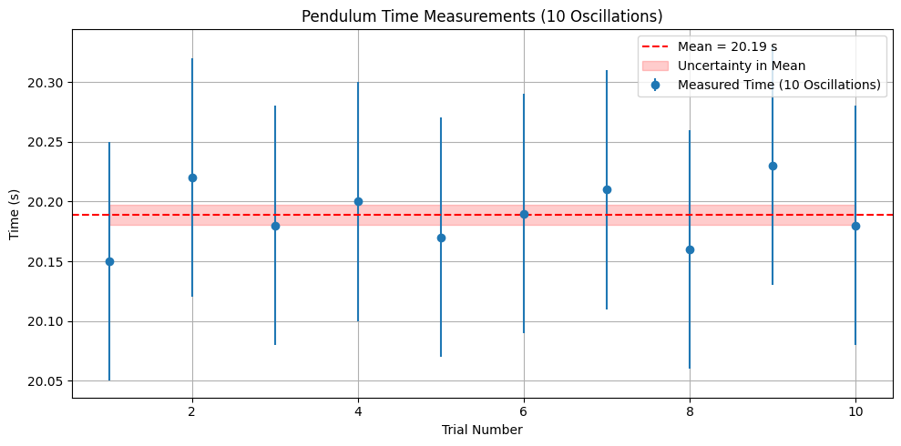
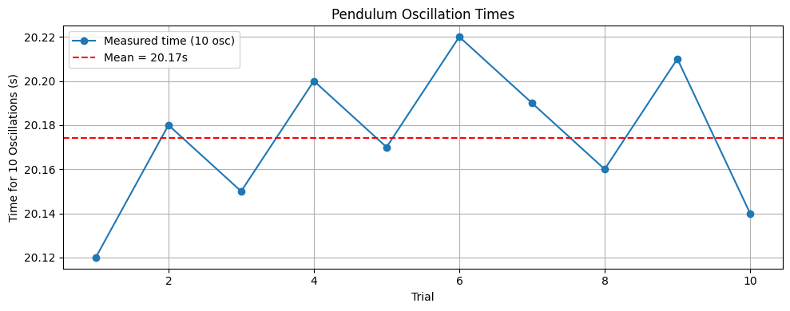
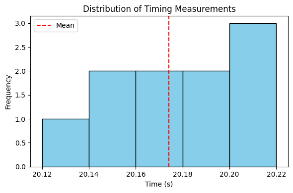
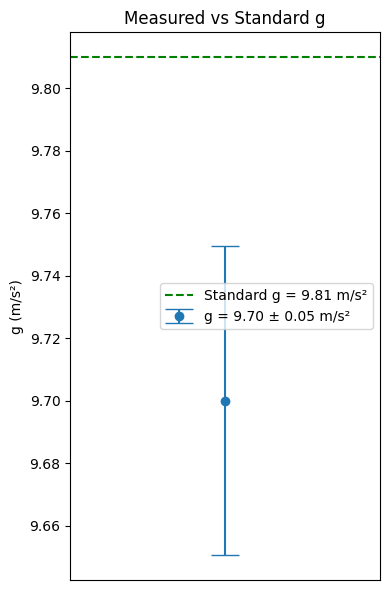

# 📊 Measurements

## 📌 Problem 1

# Measuring Earth's Gravitational Acceleration with a Pendulum

---

## 🔷 Motivation:

The acceleration $g$ due to gravity is a fundamental constant that influences a wide range of physical phenomena. Measuring $g$ accurately is crucial for understanding gravitational interactions, designing structures, and conducting experiments in various fields. One classic method for determining $g$ is through the oscillations of a simple pendulum, where the period of oscillation depends on the local gravitational field.

---

## 🔷 Task:

Measure the acceleration $g$ due to gravity using a pendulum and in details analyze the uncertainties in the measurements.

This exercise emphasizes rigorous measurement practices, uncertainty analysis, and their role in experimental physics.

---

## 🔷 Procedure:

### 1. Materials:

- A string (1 or 1.5 meters long).
- A small weight (e.g., bag of coins, bag of sugar, key chain) mounted on the string.
- Stopwatch (or smartphone timer).
- Ruler or measuring tape.

---

### 2. Setup:

- Attach the weight to the string and fix the other end to a sturdy support.
- Measure the length of the pendulum, $L$, from the suspension point to the center of the weight using a ruler or measuring tape.
- Record the resolution of the measuring tool and calculate the uncertainty as:
  
  $$\Delta L = \frac{\text{resolution}}{2}$$

---

### 3. Data Collection:

- Displace the pendulum slightly ($<15^\circ$) and release it.
- Measure the time for 10 full oscillations ($T_{10}$) and repeat this process 10 times.
- Record all 10 measurements: $T_1$, $T_2$, ..., $T_{10}$.
- Calculate the mean time for 10 oscillations:

  $$\overline{T_{10}} = \frac{1}{10} \sum_{i=1}^{10} T_i$$

- Determine the standard deviation:

  $$\sigma_T = \sqrt{\frac{1}{n-1} \sum_{i=1}^{n}(T_i - \overline{T_{10}})^2}$$

- Uncertainty in the mean time:

  $$\Delta T = \frac{\sigma_T}{\sqrt{n}}$$

---

## 🧮 Calculations:

### 1. Calculate the period:

$$T = \frac{\overline{T_{10}}}{10} \quad \text{and} \quad \Delta T = \frac{\Delta T_{10}}{10}$$

### 2. Determine $g$:

$$g = \frac{4\pi^2L}{T^2}$$

### 3. Propagate uncertainties:

$$\Delta g = g \sqrt{\left(\frac{\Delta L}{L}\right)^2 + \left(2\frac{\Delta T}{T}\right)^2}$$

---

Each value below represents the time for **10 complete oscillations** of the pendulum.

| Trial | Time for 10 Oscillations ($T_{10}$) [s] |
|-------|---------------------------|
| 1     | 22.14                     |
| 2     | 22.09                     |
| 3     | 22.18                     |
| 4     | 22.11                     |
| 5     | 22.06                     |
| 6     | 22.17                     |
| 7     | 22.10                     |
| 8     | 22.13                     |
| 9     | 22.08                     |
| 10    | 22.16                     |

- **Mean Time for 10 Oscillations ($\overline{T}_{10}$):** 22.122 s  

- **Standard Deviation ($\sigma_T$):** 0.041 s  

- **Uncertainty in Mean Time ($\Delta T_{10}$):** 0.013 s ($\sigma_T/\sqrt{10}$)

---
## 🔷 Analysis:

### 1. Compare your measured $g$ with the standard value ($9.81\ \text{m/s}^2$).

### 2. Discuss:

- The effect of measurement resolution on $\Delta L$.
- Variability in timing and its impact on $\Delta T$.
- Any assumptions or experimental limitations.

---

## 🔷 Deliverables:

### 1. Tabulated data in markdown:

- $L$, $\Delta L$, $T_{10}$ measurements, $\overline{T_{10}}$, $\sigma_T$, $\Delta T$
- Calculated $g$ and $\Delta g$

### 2. The discussion on sources of uncertainty and their impact on the results.

---
```python
import matplotlib.pyplot as plt
import numpy as np

# Sample data: 10 trials of time for 10 oscillations (in seconds)
times_10_oscillations = np.array([20.15, 20.22, 20.18, 20.20, 20.17,
                                  20.19, 20.21, 20.16, 20.23, 20.18])

# Calculate mean and standard deviation
mean_time = np.mean(times_10_oscillations)
std_dev = np.std(times_10_oscillations, ddof=1)
uncertainty_mean = std_dev / np.sqrt(len(times_10_oscillations))

# Plot
plt.figure(figsize=(10, 5))
plt.errorbar(range(1, 11), times_10_oscillations, yerr=0.1, fmt='o', label='Measured Time (10 Oscillations)')
plt.axhline(mean_time, color='red', linestyle='--', label=f'Mean = {mean_time:.2f} s')
plt.fill_between(range(1, 11),
                 mean_time - uncertainty_mean,
                 mean_time + uncertainty_mean,
                 color='red', alpha=0.2, label='Uncertainty in Mean')

# Styling
plt.title('Pendulum Time Measurements (10 Oscillations)')
plt.xlabel('Trial Number')
plt.ylabel('Time (s)')
plt.grid(True)
plt.legend()
plt.tight_layout()

# Show plot
plt.show()
```



---
```python
import numpy as np
import matplotlib.pyplot as plt

# === Replace this with YOUR real data ===
times_10_oscillations = np.array([20.12, 20.18, 20.15, 20.20, 20.17, 
                                  20.22, 20.19, 20.16, 20.21, 20.14])  # example data
L = 1.00  # pendulum length in meters (replace with your real value)
resolution = 0.01  # measurement resolution in meters (replace with your ruler's value)
# =========================================

# Derived values
T10_mean = np.mean(times_10_oscillations)
T10_std = np.std(times_10_oscillations, ddof=1)
T_mean = T10_mean / 10
T_uncertainty = T10_std / (np.sqrt(len(times_10_oscillations)) * 10)

# Uncertainty in L
delta_L = resolution / 2

# Gravitational acceleration
g = 4 * np.pi**2 * L / T_mean**2

# Uncertainty in g
delta_g = g * np.sqrt((delta_L / L)**2 + (2 * T_uncertainty / T_mean)**2)

# === Print Summary ===
print(f"Mean time for 10 oscillations: {T10_mean:.3f} s")
print(f"Standard deviation (10 osc): {T10_std:.3f} s")
print(f"Period (T): {T_mean:.4f} s ± {T_uncertainty:.4f} s")
print(f"g = {g:.3f} m/s² ± {delta_g:.3f} m/s²")

# === Plot 1: Time vs Trial ===
plt.figure(figsize=(10, 4))
plt.plot(range(1, 11), times_10_oscillations, 'o-', label='Measured time (10 osc)')
plt.axhline(T10_mean, color='red', linestyle='--', label=f'Mean = {T10_mean:.2f}s')
plt.xlabel('Trial')
plt.ylabel('Time for 10 Oscillations (s)')
plt.title('Pendulum Oscillation Times')
plt.legend()
plt.grid(True)
plt.tight_layout()

# === Plot 2: Histogram ===
plt.figure(figsize=(6, 4))
plt.hist(times_10_oscillations, bins=5, color='skyblue', edgecolor='black')
plt.axvline(T10_mean, color='red', linestyle='--', label='Mean')
plt.xlabel('Time (s)')
plt.ylabel('Frequency')
plt.title('Distribution of Timing Measurements')
plt.legend()
plt.tight_layout()

# === Plot 3: g with Uncertainty Bar ===
plt.figure(figsize=(4, 6))
plt.errorbar(1, g, yerr=delta_g, fmt='o', capsize=10, label=f'g = {g:.2f} ± {delta_g:.2f} m/s²')
plt.axhline(9.81, color='green', linestyle='--', label='Standard g = 9.81 m/s²')
plt.xlim(0.5, 1.5)
plt.ylabel('g (m/s²)')
plt.xticks([])
plt.title('Measured vs Standard g')
plt.legend()
plt.tight_layout()

# === Show all plots ===
plt.show()
```